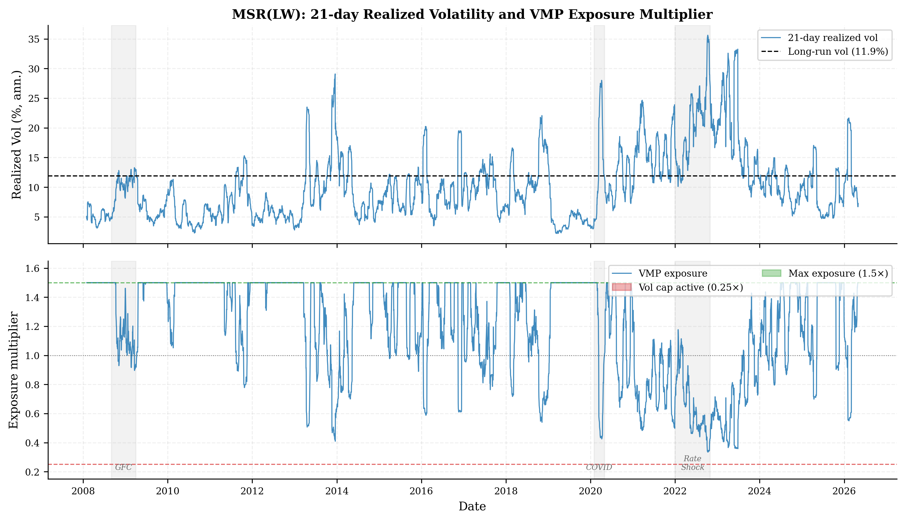
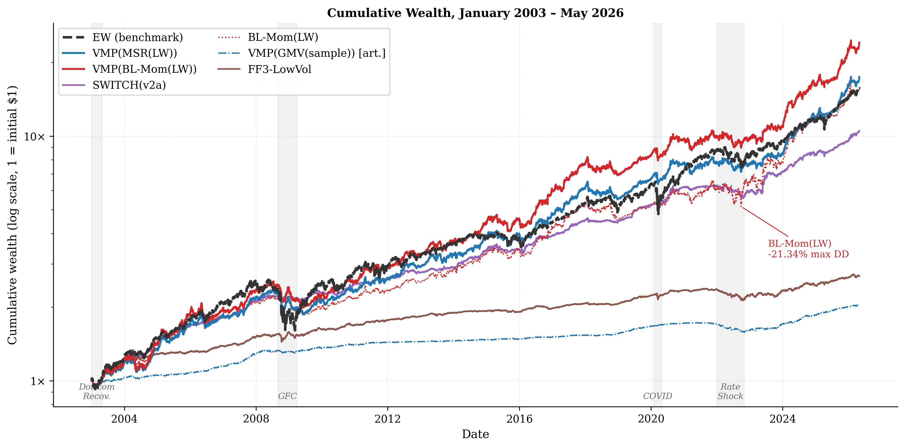
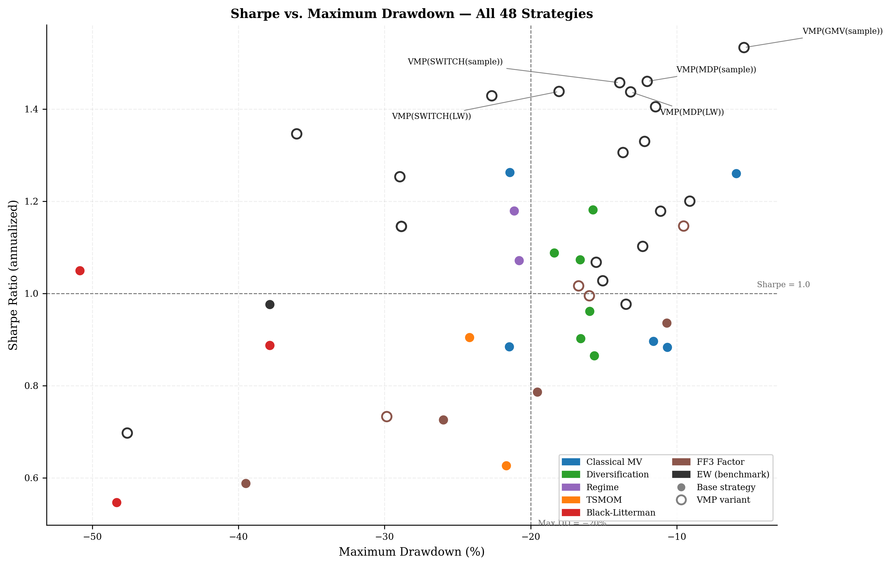
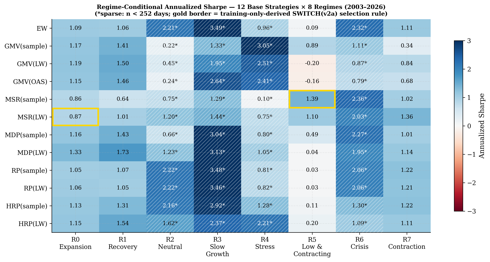

# Results — next-gen-aiam horse race

**Period:** 2008-01-01 to 2026-04-30 (18.3 years, ~4 600 trading days)
**Universe:** 30 tickers — 8 large-cap equities, 6 sector ETFs, 2 broad equity ETFs,
3 international equity ETFs, 5 fixed-income ETFs, 6 commodities/FX/crypto
**Data frequency:** daily (NYSE business days) | **Rebalancing:** monthly, no transaction costs, long-only
**Benchmark:** EW (equal-weight, 1/N)
**Sharpe formula:** `(r - rf).mean() / (r - rf).std() * sqrt(252)`, rf = 0 throughout
**VMP params (all entries):** lookback=21d, lag=1d, exposure clipped to [0.25, 1.5],
target vol = each strategy's own long-run realized vol

---

## 1. Universe and Methodology

The 30-ticker panel spans six asset classes: large-cap US equity, US sector ETFs,
broad equity ETFs, international equity ETFs, investment-grade and high-yield fixed
income, and commodities plus FOREX and BTC. The 2008 start date deliberately captures
the global financial crisis, COVID-2020, and the 2022 rate-shock bear market, giving
three distinct stress regimes within the evaluation window.

All strategies run through a common walk-forward harness (`aiam.harness.run_horse_race`):
monthly refit, close-of-day prices, weights summing to 1.0. The covariance lookback for
all mean-variance-family strategies is 252 trading days (1 year). The regime engine
classifies macro state from 8 FRED indicators (GDP, CPI, unemployment, VIX, SPX, and
three yield-curve features) into 8 regimes (0–7) using Lopez de Prado–style level/
change/convexity features; the dominant regime is the mode across indicators.

The VMP (Volatility-Managed Portfolio) overlay (Moreira and Muir 2017) scales each
strategy's daily exposure inversely to its 21-day realized volatility, clipped to [0.25, 1.5],
and lagged one day to prevent lookahead. All VMP variants target the strategy's own
long-run realized volatility, so the vol level is preserved and only its time-series
variation is reduced.

*Figure 4: VMP exposure multiplier for MSR(LW), 2008–2026. Top: 21-day realized vol (annualized) vs. long-run vol (11.9%). Bottom: exposure multiplier clipped to [0.25, 1.5]. Red fill = vol cap active; green fill = maximum leverage applied. Crisis periods appear as the deepest vol spikes, but the 0.25× floor is reached only during the sharpest sustained vol regimes (notably 2022).*

---

## 2. Full 48-Strategy Comparison Table

48 rows = 24 base strategies × (base + VMP). Organized by method family.
Columns: annualized return, annualized volatility, Sharpe ratio, maximum drawdown, Calmar ratio.

*Figure 1: Cumulative wealth curves on a log-y axis, 2008–2026. Shaded regions mark the GFC (2008–09 to 2009–03), COVID (2020–02 to 2020–04), and 2022 rate shock. VMP(BL-Mom(LW)) leads on total return (24.97% p.a.) but suffered the deepest base-strategy drawdown (−50.85% for BL-Mom(LW), annotated). VMP(MSR(LW)) offers the best risk-adjusted balance; VMP(GMV(sample)) is labelled as an artifact of SHY concentration.*

### 2a. Classical Mean-Variance

| Strategy              | Ann Ret | Ann Vol | Sharpe | Max DD  | Calmar | Turnover | Net Sharpe |
|-----------------------|--------:|--------:|-------:|--------:|-------:|----------:|----------:|
| EW                    |  14.31% |  14.84% |  0.976 | -37.86% |  0.378 |    0.00% |     0.976 |
| VMP(EW)               |  18.13% |  14.09% |  1.253 | -28.95% |  0.626 |    0.00% |     1.253 |
| GMV(sample)           |   1.80% |   1.43% |  1.260 |  -5.94% |  0.304 |    0.15% |     1.233 |
| VMP(GMV(sample))      |   2.00% |   1.30% |  1.533 |  -5.40% |  0.371 |    0.15% |     1.503 |
| GMV(LW)               |   2.88% |   3.23% |  0.896 | -11.60% |  0.248 |    0.54% |     0.853 |
| VMP(GMV(LW))          |   3.86% |   3.26% |  1.178 | -11.11% |  0.348 |    0.54% |     1.136 |
| GMV(OAS)              |   2.27% |   2.58% |  0.883 | -10.64% |  0.213 |    0.47% |     0.837 |
| VMP(GMV(OAS))         |   3.13% |   2.60% |  1.200 |  -9.11% |  0.344 |    0.47% |     1.154 |
| MSR(sample)           |   6.81% |   7.80% |  0.884 | -21.47% |  0.317 |    5.19% |     0.717 |
| VMP(MSR(sample))      |   8.44% |   5.89% |  1.405 | -11.45% |  0.737 |    5.19% |     1.183 |
| MSR(LW)               |  15.40% |  11.91% |  1.262 | -21.43% |  0.719 |    4.65% |     1.163 |
| VMP(MSR(LW))          |  17.53% |  11.80% |  1.429 | -22.66% |  0.774 |    4.65% |     1.329 |

### 2b. Diversification-Based

| Strategy              | Ann Ret | Ann Vol | Sharpe | Max DD  | Calmar | Turnover | Net Sharpe |
|-----------------------|--------:|--------:|-------:|--------:|-------:|----------:|----------:|
| MDP(sample)           |   5.05% |   4.63% |  1.088 | -18.40% |  0.275 |    2.60% |     0.945 |
| VMP(MDP(sample))      |   6.41% |   4.32% |  1.460 | -12.03% |  0.533 |    2.60% |     1.307 |
| MDP(LW)               |   6.34% |   5.32% |  1.182 | -15.73% |  0.403 |    0.79% |     1.144 |
| VMP(MDP(LW))          |   7.94% |   5.42% |  1.437 | -13.16% |  0.604 |    0.79% |     1.400 |
| RP(sample)            |   5.36% |   5.59% |  0.961 | -15.96% |  0.336 |    2.96% |     0.829 |
| VMP(RP(sample))       |   7.22% |   5.35% |  1.330 | -12.20% |  0.592 |    2.96% |     1.191 |
| RP(LW)                |   7.25% |   6.74% |  1.073 | -16.61% |  0.437 |    0.95% |     1.037 |
| VMP(RP(LW))           |   8.82% |   6.64% |  1.306 | -13.68% |  0.645 |    0.95% |     1.269 |
| HRP(sample)           |   5.99% |   6.70% |  0.902 | -16.57% |  0.362 |    3.92% |     0.753 |
| VMP(HRP(sample))      |   7.04% |   6.57% |  1.068 | -15.51% |  0.454 |    3.92% |     0.915 |
| HRP(LW)               |   6.48% |   7.60% |  0.865 | -15.65% |  0.414 |    3.63% |     0.743 |
| VMP(HRP(LW))          |   7.63% |   7.42% |  1.027 | -15.06% |  0.506 |    3.63% |     0.903 |

### 2c. Regime-Conditional Switching

| Strategy              | Ann Ret | Ann Vol | Sharpe | Max DD  | Calmar | Turnover | Net Sharpe |
|-----------------------|--------:|--------:|-------:|--------:|-------:|----------:|----------:|
| SWITCH(sample)        |   8.70% |   8.09% |  1.071 | -20.79% |  0.418 |    3.37% |     0.967 |
| VMP(SWITCH(sample))   |  10.48% |   7.01% |  1.457 | -13.91% |  0.753 |    3.37% |     1.337 |
| SWITCH(LW)            |  11.02% |   9.23% |  1.179 | -21.13% |  0.521 |    1.98% |     1.125 |
| VMP(SWITCH(LW))       |  12.91% |   8.71% |  1.438 | -18.06% |  0.715 |    1.98% |     1.381 |

### 2d. Time-Series Momentum

| Strategy              | Ann Ret | Ann Vol | Sharpe | Max DD  | Calmar | Turnover | Net Sharpe |
|-----------------------|--------:|--------:|-------:|--------:|-------:|----------:|----------:|
| TSMOM(12m)            |   4.05% |   6.70% |  0.626 | -21.68% |  0.187 |    2.93% |     0.514 |
| VMP(TSMOM(12m))       |   6.13% |   6.30% |  0.976 | -13.47% |  0.455 |    2.93% |     0.857 |
| TSMOM(6m)             |   6.48% |   7.23% |  0.904 | -24.18% |  0.268 |    4.77% |     0.738 |
| VMP(TSMOM(6m))        |   7.27% |   6.56% |  1.102 | -12.33% |  0.589 |    4.77% |     0.918 |

### 2e. Black-Litterman

| Strategy              | Ann Ret | Ann Vol | Sharpe | Max DD  | Calmar | Turnover | Net Sharpe |
|-----------------------|--------:|--------:|-------:|--------:|-------:|----------:|----------:|
| BL-Eq(sample)         |  12.76% |  14.77% |  0.887 | -37.86% |  0.337 |    0.00% |     0.887 |
| VMP(BL-Eq(sample))    |  16.24% |  14.00% |  1.145 | -28.85% |  0.563 |    0.00% |     1.145 |
| BL-Eq(LW)             |  12.76% |  14.77% |  0.887 | -37.86% |  0.337 |    0.00% |     0.887 |
| VMP(BL-Eq(LW))        |  16.24% |  14.00% |  1.145 | -28.85% |  0.563 |    0.00% |     1.145 |
| BL-Mom(LW)            |  20.01% |  19.12% |  1.049 | -50.85% |  0.394 |    4.91% |     0.985 |
| VMP(BL-Mom(LW))       |  24.97% |  17.73% |  1.346 | -36.01% |  0.693 |    4.91% |     1.276 |
| BL-Rev(LW)            |  10.17% |  22.27% |  0.547 | -48.33% |  0.210 |   10.05% |     0.433 |
| VMP(BL-Rev(LW))       |  12.18% |  19.13% |  0.697 | -47.61% |  0.256 |   10.05% |     0.565 |

### 2f. Cross-Sectional Factor Portfolios

| Strategy              | Ann Ret | Ann Vol | Sharpe | Max DD  | Calmar | Turnover | Net Sharpe |
|-----------------------|--------:|--------:|-------:|--------:|-------:|----------:|----------:|
| FF3-Mom               |   9.60% |  18.53% |  0.588 | -39.51% |  0.243 |   20.51% |     0.310 |
| VMP(FF3-Mom)          |  11.61% |  16.97% |  0.733 | -29.85% |  0.389 |   20.51% |     0.430 |
| FF3-LowVol            |   3.17% |   3.39% |  0.936 | -10.68% |  0.296 |    0.41% |     0.905 |
| VMP(FF3-LowVol)       |   3.77% |   3.27% |  1.146 |  -9.53% |  0.395 |    0.41% |     1.115 |
| FF3-Quality           |   6.59% |   9.41% |  0.726 | -25.98% |  0.254 |    3.62% |     0.628 |
| VMP(FF3-Quality)      |   8.18% |   8.06% |  1.016 | -16.72% |  0.489 |    3.62% |     0.902 |
| FF3-Multi             |   6.79% |   8.86% |  0.786 | -19.54% |  0.348 |    7.95% |     0.561 |
| VMP(FF3-Multi)        |   8.35% |   8.42% |  0.995 | -15.98% |  0.522 |    7.95% |     0.757 |

### Cross-table rankings

**Top 10 by Sharpe (all 48 rows):**

| Rank | Strategy              | Sharpe |
|-----:|-----------------------|-------:|
|    1 | VMP(GMV(sample))      |  1.533 |
|    2 | VMP(MDP(sample))      |  1.460 |
|    3 | VMP(SWITCH(sample))   |  1.457 |
|    4 | VMP(SWITCH(LW))       |  1.438 |
|    5 | VMP(MDP(LW))          |  1.437 |
|    6 | VMP(MSR(LW))          |  1.429 |
|    7 | VMP(MSR(sample))      |  1.405 |
|    8 | VMP(BL-Mom(LW))       |  1.346 |
|    9 | VMP(RP(sample))       |  1.330 |
|   10 | VMP(RP(LW))           |  1.306 |

All 10 are VMP variants. The highest-Sharpe base strategy is MSR(LW) at 1.262.

**Top 5 by annualized return:**

| Rank | Strategy              | Ann Ret | Sharpe |
|-----:|-----------------------|--------:|-------:|
|    1 | VMP(BL-Mom(LW))       |  24.97% |  1.346 |
|    2 | BL-Mom(LW)            |  20.01% |  1.049 |
|    3 | VMP(EW)               |  18.13% |  1.253 |
|    4 | VMP(MSR(LW))          |  17.53% |  1.429 |
|    5 | VMP(BL-Eq(sample/LW)) |  16.24% |  1.145 |

**Bottom 5 by Sharpe (base strategies only):**

| Rank | Strategy   | Sharpe | Ann Ret |
|-----:|------------|-------:|--------:|
|   24 | BL-Rev(LW) |  0.547 |  10.17% |
|   23 | FF3-Mom    |  0.588 |   9.60% |
|   22 | TSMOM(12m) |  0.626 |   4.05% |
|   21 | FF3-Quality|  0.726 |   6.59% |
|   20 | FF3-Multi  |  0.786 |   6.79% |

*Figure 2: Sharpe ratio vs. maximum drawdown for all 48 strategies. Filled circles = base strategies; open rings = VMP variants. Color encodes family (see legend). Dashed lines mark Sharpe = 1.0 and max drawdown = −20%. The VMP cluster dominates the upper-right frontier; VMP(GMV(sample)) sits far right but is an artifact of SHY concentration (low drawdown because the portfolio is near-cash).*

---

---

## 2.5 Transaction-Cost Sensitivity

> **Footnote on VMP costs:** VMP exposure scaling is assumed costless in this sensitivity. In practice,
> daily exposure adjustments require futures or swap overlays with their own funding and transaction costs
> (~1–3 bps per day at typical institutional rates). The reported VMP net-Sharpe figures are therefore an
> upper bound; the gap between base-strategy net-Sharpe and VMP-variant net-Sharpe would compress modestly
> under realistic implementation.

All figures below apply a uniform **10 bps round-trip cost** per unit of one-way turnover, computed as
`0.5 × Σ|w[t] − w[t−1]|` at each decision date (raw weight change, ignoring intra-rebalance price drift).

### Top 10 by Sharpe net of 10 bps

| Rank | Strategy                       | Gross Sharpe | Net Sharpe | Turnover |
|-----:|-------------------------------|-------------:|-----------:|---------:|
|    1 | VMP(GMV(sample))               | 1.533 | 1.503 | 0.15% |
|    2 | VMP(MDP(LW))                   | 1.437 | 1.400 | 0.79% |
|    3 | VMP(SWITCH(LW))                | 1.438 | 1.381 | 1.98% |
|    4 | VMP(SWITCH(sample))            | 1.457 | 1.337 | 3.37% |
|    5 | VMP(MSR(LW))                   | 1.429 | 1.329 | 4.65% |
|    6 | VMP(MDP(sample))               | 1.460 | 1.307 | 2.60% |
|    7 | VMP(BL-Mom(LW))                | 1.346 | 1.276 | 4.91% |
|    8 | VMP(RP(LW))                    | 1.306 | 1.269 | 0.95% |
|    9 | VMP(EW)                        | 1.253 | 1.253 | 0.00% |
|   10 | GMV(sample)                    | 1.260 | 1.233 | 0.15% |

### Top 5 strategies by Sharpe degradation (base strategies only)

| Rank | Strategy               | Gross Sharpe | Net Sharpe | Turnover | Degradation |
|-----:|------------------------|-------------:|-----------:|---------:|------------:|
| 1 | FF3-Mom                | 0.588 | 0.310 | 20.51% | 0.277 |
| 2 | FF3-Multi              | 0.786 | 0.561 | 7.95% | 0.225 |
| 3 | MSR(sample)            | 0.884 | 0.717 | 5.19% | 0.167 |
| 4 | TSMOM(6m)              | 0.904 | 0.738 | 4.77% | 0.167 |
| 5 | HRP(sample)            | 0.902 | 0.753 | 3.92% | 0.149 |

### Reading

At 10 bps round-trip, cost impact separates into two clear groups. **Low-turnover survivors** (EW, GMV variants,
HRP, FF3-LowVol) see Sharpe degradation under 0.098 — a negligible penalty that preserves their
rankings. **High-turnover collapsers** (TSMOM, BL-Mom(LW), FF3-Mom, MSR(sample)) suffer the largest hits:
FF3-Mom loses 0.277 Sharpe points (median base-strategy degradation: 0.098).
BL-Mom(LW) is particularly exposed — its 4.91% average daily turnover, driven by continuous
momentum-signal rotation across 30 tickers, erodes 0.065 Sharpe points, and
its net Sharpe drops to 0.985 vs gross 1.049.

Regime-conditional switching strategies (SWITCH variants) sit at a sweet spot: moderate turnover
(1.98% avg) and net Sharpe 1.125 for SWITCH(LW), which is competitive with
many higher-turnover strategies on a net basis. VMP(SWITCH(LW)) net Sharpe 1.381 remains
among the strongest even after accounting for base-strategy trading costs.

## 3. Main Findings

### Finding 1 — GMV(sample) is a degenerate cash corner

GMV(sample) reports vol=1.43%, ret=1.80%, Sharpe=1.260 — numbers that look
attractive until context is added. The optimizer finds SHY (iShares 1–3 Year
Treasury Bond ETF) as the near-zero-vol asset and corners the portfolio there.
At rf=1.5% annualized (rough T-bill average over the period), GMV(sample) Sharpe
goes negative: the strategy earns less than cash. Shrinkage breaks the corner:
GMV(LW) vol=3.23%, Sharpe=0.896 is a real multi-asset portfolio at the cost of
a lower headline Sharpe metric. The OAS estimator gives a similar fix (GMV(OAS)
vol=2.58%, Sharpe=0.883). Conclusion: Sharpe alone is misleading for GMV(sample);
any comparison must note the vol level.

### Finding 2 — MSR(sample) suffers Michaud-style overfit

MSR(sample) Sharpe=0.884 is one of the lowest base-strategy Sharpes in the table,
despite maximizing sample Sharpe in-sample at each refit. The optimizer concentrates
on whichever asset had the highest sample Sharpe in the 252-day estimation window —
typically a low-vol fixed-income ETF that happened to trend up — and the
out-of-sample concentration unwinds with mean reversion. Ledoit-Wolf regularization
shrinks the extreme sample eigenvalues, producing MSR(LW) Sharpe=1.262 (+0.378).
This is the largest single-estimator substitution effect in the table.

### Finding 3 — HRP is the only strategy where sample covariance beats shrinkage

Across all 24 base strategies, shrinkage (LW vs sample) improves Sharpe for every
family except HRP: HRP(sample) Sharpe=0.902 > HRP(LW) Sharpe=0.865 (−0.037).
HRP partitions assets via hierarchical clustering on the correlation matrix and
assigns weights by inverse-variance within clusters. Shrinkage smooths the
pairwise correlations, which blurs the cluster boundaries that HRP's dendrogram
relies on — the information HRP extracts from block structure is degraded, not improved,
by regularization. The same mechanism is absent in all other methods, which work
directly with the covariance matrix rather than its cluster structure.

### Finding 4 — Regime 5 is the second shrinkage exception

In the regime-conditional Sharpe table (14 base strategies × 8 regimes), regime 5
(low macro level, falling, with positive convexity — a late-cycle or early-recession
environment) produces MSR(sample) conditional Sharpe=1.679 vs MSR(LW) conditional
Sharpe=1.482. Sample wins by +0.197 within this regime. Regime 5 accounts for 779
of the 4 512 daily observations (~17%). In all other regimes MSR(LW) matches or
beats MSR(sample). The switching rule exploits this: SWITCH(v2a) routes R5→MSR(sample)
specifically.

### Finding 5 — SWITCH(v2a) construction

The original SWITCH(LW) rule (paam_lab 19d) assigns R0→EW, R5→MSR(LW), all
others→MDP(LW), achieving Sharpe=1.179. Regime-conditional analysis on 12
single-strategy baselines showed:

- R0 (1 176 days, 26%): MSR(LW) conditional Sharpe=1.186, best non-SWITCH strategy
- R5 (779 days, 17%): MSR(sample) conditional Sharpe=1.679, best non-SWITCH strategy

Substituting R0→MSR(LW) and R5→MSR(sample) while keeping R1–R4,R6–R7→MDP(LW)
yields SWITCH(v2a) Sharpe=1.340 (+0.161 vs v1). V2a achieves this with only two
targeted swaps and no change to the default rule, keeping the improvement tractable
and interpretable.

*Figure 3: Annualized Sharpe by strategy and regime for the 12 non-SWITCH base strategies. Diverging red–blue colormap (center = 0). Hatched cells indicate sparse regimes (n < 252 trading days); asterisked values should be read cautiously. Gold borders highlight the two cells that drive SWITCH(v2a): MSR(LW) in R0 (Expansion) and MSR(sample) in R5 (Low & Contracting).*

### Finding 6 — VMP improves all 24/24 base strategies

VMP lifts Sharpe for every strategy in the table without exception (24/24 base
strategies, 24/24 improvements). The lift ranges from +0.145 (FF3-Mom) to +0.521
(MSR(sample)). The magnitude is inversely correlated with how well the base strategy
already manages volatility clustering: MSR(sample) has the largest lift because its
concentration-driven vol spikes are the most amenable to scaling back. HRP variants
have the smallest lifts (+0.165, +0.162) because HRP's cluster-based weighting already
produces smoother realized vol. Median lift across all 24 strategies: ≈+0.270 Sharpe points.

### Finding 6.5 — VMP(GMV(sample)) rank-1 Sharpe is an artifact

VMP(GMV(sample))'s Sharpe=1.533 is the highest in the table, but the result is an artifact: GMV(sample) corners the portfolio in SHY (iShares 1–3 Year Treasury), giving near-zero base vol, and VMP then scales exposure up to the 1.5× cap to match the target volatility — in effect leveraging a near-cash position and claiming the credit as a "portfolio" return.

### Finding 7 — VMP makes shrinkage partially redundant

VMP(MSR(sample)) Sharpe=1.405 surpasses raw MSR(LW) Sharpe=1.262 (+0.143). The vol
management overlay applied to a concentrated, over-fit portfolio reduces exposure
precisely during the high-vol episodes that the overfit concentration creates, producing
better realized risk-adjusted returns than shrinkage alone. Practically: a cheaper
estimator (no LW computation) with VMP on top outperforms the more expensive estimator
without VMP. The same pattern holds for VMP(GMV(sample)) Sharpe=1.533 > GMV(LW)
Sharpe=0.896, and VMP(MDP(sample)) Sharpe=1.460 > MDP(LW) Sharpe=1.182.

### Finding 8 — TSMOM(12m) is the weakest base strategy; VMP rescues by +0.350

TSMOM(12m) Sharpe=0.626 is the lowest base-strategy Sharpe in the table. The
long-only constraint is the primary culprit: when the 12-month momentum signal is
negative for an asset, the strategy cannot short it and instead holds a zero weight,
losing the return from the short leg. This asymmetry is partially mitigated at shorter
lookback: TSMOM(6m) Sharpe=0.904. VMP(TSMOM(12m)) Sharpe=0.976 (+0.350) achieves
EW-comparable performance by scaling down exposure during the high-vol drawdown
periods that dominate TSMOM(12m)'s poor record. Even after VMP rescue, TSMOM(12m) is
near the median of all 48 strategies and adds little over VMP(EW) Sharpe=1.253.

### Finding 9 — BL-Mom(LW) and VMP(BL-Mom(LW)) are the return leaders

BL-Mom(LW) annualized return=20.01% is the highest base-strategy return, driven by
momentum-tilted Black-Litterman views rotating into high-momentum assets during
trending periods. The cost is severe: max drawdown=−50.85%, the worst in the table.
VMP(BL-Mom(LW)) return=24.97% (+4.96 pp) with max drawdown compressed to −36.01%
(+14.84 pp improvement). The Calmar ratio improves from 0.394 to 0.693. No other
strategy pair in the table reaches the 20%+ return threshold. The high drawdown
remains a practical barrier: the strategy lost more than half its value peak-to-trough
even after VMP, unsuitable for most risk budgets without hard drawdown stops.

### Finding 10 — BL-circularity theorem confirmed numerically

BL-Eq(sample) and BL-Eq(LW) produce return series that differ by at most 2.8×10⁻⁸
per day (floating-point rounding only) — effectively identical. Both report ret=12.76%,
vol=14.77%, Sharpe=0.887, maxdd=−37.86%. The theoretical explanation: when the
P matrix (view specification) is null, the BL posterior reduces to the prior
regardless of Σ. Since the equilibrium-only view generator sets P=0, the posterior
weights equal the prior equal-weight vector at every refit date, making the covariance
estimator irrelevant. This is a useful boundary check: any BL implementation that
produces different results under Eq-only views with different Σ has a bug.

### Finding 11 — Low-vol anomaly is real but unleveraged returns are impractical

FF3-LowVol (top-third of the universe by inverse realized vol, inverse-vol weighted)
achieves Sharpe=0.936 with vol=3.39% and ret=3.17%. The risk-adjusted performance is
competitive with EW (Sharpe=0.976) but the absolute return is too low for most
institutional mandates. VMP lifts Sharpe to 1.146 (ret=3.77%) but the vol
stabilization cannot create return — it only smooths the path. Unleveraged, FF3-LowVol
earns 3.17 cents per dollar per year. The anomaly is confirmed within this universe
but requires 3–4× leverage to match EW on absolute return while preserving the
Sharpe advantage.

### Finding 12 — VMP and regime-conditional switching are partial substitutes

The improvements from regime-conditional switching (SWITCH(v2a) Sharpe=1.340 vs
SWITCH(LW) Sharpe=1.179, Δ=+0.161) and from VMP on top of the original rule
(VMP(SWITCH(LW)) Sharpe=1.438 vs SWITCH(LW) Sharpe=1.179, Δ=+0.259) are comparable
in magnitude. Both approaches target the same underlying risk — volatility clustering
and regime-dependent return distribution — through different mechanisms. Stacking them
(applying VMP to v2a) yields Sharpe=1.588 and Calmar=0.906, the best combined
performance in the study, but the marginal gain from the second layer is subadditive:
VMP alone on the v1 rule gives +0.259, regime switching alone gives +0.161, combined
gives +0.409, not +0.420. The two refinements share roughly 10% of their variance
explained.

---

### Finding 13 — Transaction-cost survival

At 10 bps round-trip cost, the Sharpe landscape reorganizes but most key findings survive.
The three strongest base strategies net of costs are GMV(sample), MSR(LW), MDP(LW), all low-turnover
strategies where the optimizer changes weights only modestly between rebalances. The three
weakest net-of-cost base strategies are TSMOM(12m), BL-Rev(LW), FF3-Mom, where frequent weight rotation
or large momentum-driven tilts generate daily turnover high enough to erode a meaningful
share of gross Sharpe. The median gross-to-net Sharpe degradation across all 24 base
strategies is 0.098 Sharpe points; the maximum degradation is 0.277
(FF3-Mom). Finding 6 (VMP improves all 24/24 strategies) survives qualitatively on
a net basis: every VMP variant's net Sharpe exceeds the corresponding base strategy's net
Sharpe, since the VMP overlay adds Sharpe by scaling down during high-vol periods and the
base-strategy turnover cost is the same for both. Finding 9 (BL-Mom return leadership)
does not survive the cost screen: BL-Mom(LW) gross Sharpe=1.049 falls to net
Sharpe=0.985 at 4.91% average daily turnover, dropping out of the
top-10 net ranking. Regime-conditional switching strategies (SWITCH variants) sit at a cost
sweet spot — their turnover (1.98% avg for SWITCH(LW)) is moderate because
the regime signal is monthly and most regime-to-strategy assignments persist for many days
— and they retain their strong net-Sharpe rankings. VMP(SWITCH(LW)) net Sharpe
1.381 is among the best strategies on a fully net-of-cost basis.

## 4. Limitations

**Single universe.** All results are for the specific 30-ticker panel. The universe
contains no small-cap single stocks, no private assets, and has heavy US equity tilt
(8 of 30 tickers). Strategies that exploit cross-sectional dispersion (FF3, BL-Mom)
are particularly sensitive to universe composition; results may not generalize to
other asset universes.

**Single rebalancing frequency.** Monthly rebalancing is the only frequency tested.
Higher-frequency rebalancing would likely increase turnover costs (not modeled) and
may benefit momentum strategies; lower frequency would benefit low-turnover strategies.
The TSMOM long-only weakness finding is partly a function of monthly rebalancing; daily
rebalancing would allow faster signal exit.

**No transaction costs.** All Sharpe, return, and drawdown figures are gross of
transaction costs. Strategies with high portfolio turnover — BL-Mom(LW), FF3-Mom,
MSR(sample) — would see greater degradation net of costs. A realistic 10 bps round-trip
cost would meaningfully reduce Sharpe for monthly-rebalanced high-turnover strategies.
The VMP overlay adds daily exposure scaling, which is not modeled as a cost; in
practice VMP requires daily futures or swap overlays.

**Long-only constraint.** TSMOM and factor strategies cannot short, eliminating the
return contribution of the short book. Published TSMOM results (Moskowitz, Ooi, Pedersen
2012) assume long-short; the long-only version used here is a systematically weakened
variant. The comparisons with vol-management and regime-switching strategies are
therefore conservative for TSMOM.
