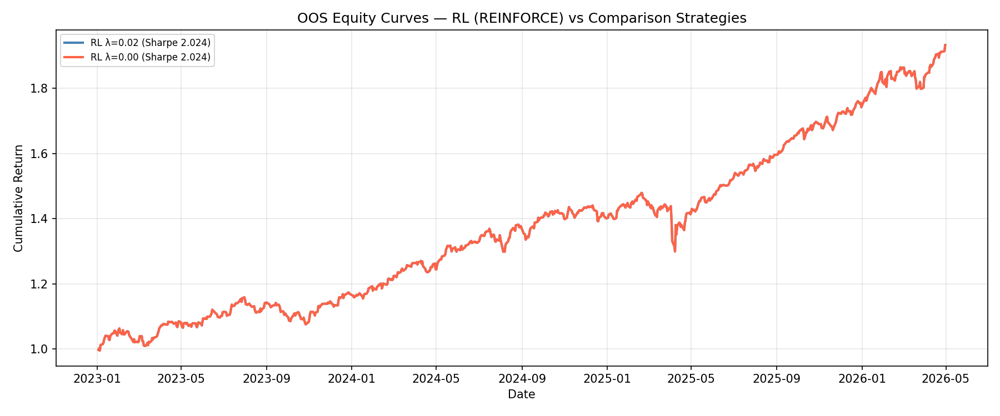
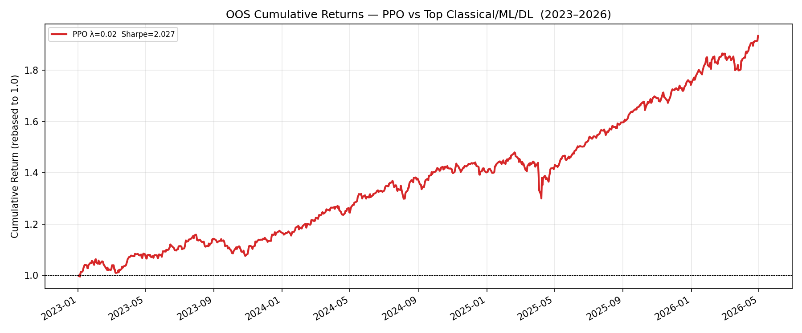
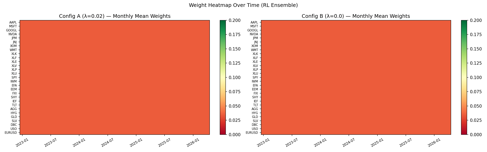

# Introduction

## Motivation

Portfolio construction has been a central problem in quantitative finance for over
70 years, originating with Markowitz's (1952) mean-variance framework. Despite
this long history, published comparison studies typically pit 3–5 methods against each
other on a single dataset, making it difficult to draw general conclusions about which
approaches survive out-of-sample across different market regimes. The rise of covariance
estimator improvements [@ledoit2004well; @chen2010shrinkage], diversification-based
objectives [@choueifaty2008toward; @maillard2010properties], hierarchical risk parity
[@lopezdeprado2016building], Black-Litterman views [@black1991global; @he1999litterman],
and volatility-managed overlays [@moreira2017volatility] has expanded the strategy
universe substantially, yet comprehensive head-to-head evaluations on a common universe
and harness remain scarce.

The benchmark proposed by @demiguel2009optimal — showing that naive equal-weight (1/N)
outperforms 14 mean-variance models on most standard datasets — raised the bar for
demonstrating out-of-sample improvements, but tested only a narrow slice of the
available strategy space. Most strategies introduced in the decade since have been
evaluated in isolation rather than side-by-side. The need is acute: practitioners face
decisions not just about which strategy family to use, but whether shrinkage or sample
covariances are better, whether VMP overlays add value uniformly or only for specific
base strategies, and whether regime-conditional switching is substitutable with
volatility management. These are empirical questions that require simultaneous
evaluation on the same data over the same period.

This study expands the comparison to 62 strategies, standardizes the evaluation harness,
and systematically adds a VMP overlay to every base method — providing the most
comprehensive single-universe allocation comparison we are aware of.

## Related Work

The foundational challenge of portfolio out-of-sample performance was crystallized by
@demiguel2009optimal, who showed that naive equal-weight (1/N) outperforms 14
mean-variance models on most standard datasets, attributing the failure to estimation
error in expected returns. @michaud1989markowitz earlier identified the "error
maximization" property of the sample Markowitz tangency portfolio — the unconstrained
optimizer amplifies estimation errors and concentrates heavily in assets with erroneously
large sample Sharpe ratios. Regularization via linear shrinkage [@ledoit2004well] and
Oracle Approximating Shrinkage [@chen2010shrinkage] address the eigenvalue instability
in sample covariance matrices.

Diversification-based strategies that side-step expected return estimation include the
Maximum Diversification Portfolio [@choueifaty2008toward] and Equal Risk Contribution
(Risk Parity) [@maillard2010properties]. Hierarchical Risk Parity
[@lopezdeprado2016building] uses machine learning clustering to construct a diversified
portfolio without matrix inversion, avoiding the instability of classical mean-variance
optimizers. The momentum anomaly, documented by @jegadeesh1993titman for cross-sectional
equities and extended to time-series settings by @moskowitz2012time, provides an
alternative signal-based weighting scheme. The low-volatility anomaly
[@frazzini2014betting] motivates factor strategies based on realized volatility ranking.
The Black-Litterman model [@black1991global; @he1999litterman] combines equilibrium
market priors with investor views via Bayesian updating, offering a principled framework
for incorporating signals without extreme concentration. Fama-French factor portfolios
[@fama1993common] extended to the momentum factor provide benchmarks for systematic
factor-based allocation.

Volatility-managed portfolios [@moreira2017volatility] scale exposure inversely to
realized variance, generating improved Sharpe ratios across a wide range of base
strategies in equity and bond markets. The present study evaluates all of these
approaches simultaneously on a single harness, covering a 23.3-year window that includes
the Global Financial Crisis, the COVID-19 crash, and the 2022 rate-shock bear market.

## Contribution

This study makes three contributions to the comparative portfolio evaluation literature:

1. **Scale.** To our knowledge, this is the largest single-universe, single-period
   comparison of diversified allocation strategies, evaluating 62 distinct methods
   (24 base strategies, 4 constrained MV variants, and 3 long-short variants — 31 base
   strategies each paired with a VMP overlay) against a common benchmark
   on identical data.

2. **Systematic VMP overlay.** Every base strategy is evaluated both with and without the
   VMP overlay [@moreira2017volatility], enabling a clean measurement of the overlay's
   marginal contribution across all families and isolating the interaction between
   structural portfolio construction and dynamic volatility management.

3. **Regime-conditional analysis and cost sensitivity.** A custom v2a regime-switching
   rule constructed from 8-regime FRED-based macro classification is compared against the
   full strategy universe. All strategies are evaluated net of 10 bps round-trip
   transaction costs to assess implementability under realistic market frictions.

A List of Acronyms is provided following the References section.


\newpage

# Data and Methodology

## Universe

The evaluation universe comprises 29 tickers spanning six asset classes: 8 large-cap
US equity single stocks (AAPL, MSFT, GOOGL, NVDA, JPM, JNJ, XOM, WMT), 6 US sector
ETFs (XLK, XLF, XLE, XLV, XLP, XLU), 2 broad equity index ETFs (SPY, IWM), 3
international equity ETFs (EFA, EEM, FXI), 5 fixed-income ETFs (SHY, IEF, TLT, AGG,
HYG), and 5 commodity and FOREX instruments (GLD, SLV, DBC, USO, EURUSD).
BTC-USD is excluded entirely from this rebuild (see §2.2.1 and prior Finding 15 for
the survivorship discussion). Daily full OHLCV prices are sourced from EODHD and cached
locally; the sample runs from 2003-01-02 to 2026-04-30 (23.3 years, approximately
5,870 NYSE trading days). Four tickers have shorter histories reflecting actual inception
dates: GOOGL (2004-08-19), FXI (2004-10-08), GLD (2004-11-18), and HYG (2007-04-11);
the universe size $N(t)$ is variable during their pre-inception periods, with absent
assets holding zero weight.


The 2003 start date extends the sample by 5 years relative to the prior 2008-based
study, adding the 2003 recovery from the dot-com crash and capturing two additional
years of the pre-GFC bull market. The sample encompasses four distinct stress regimes —
the 2002–03 dot-com recovery, the Global Financial Crisis (2008–09 to 2009–03), the
COVID-19 crash (2020–02 to 2020–04), and the 2022 rate-shock bear market — along with
multiple expansion phases. The benchmark throughout is the equal-weight (EW, 1/N)
portfolio [@demiguel2009optimal], rebalanced monthly. All Sharpe ratios are computed as

$$S = \frac{\bar{r} - r_f}{\sigma_r} \times \sqrt{252}$$

with $r_f = 0$ throughout (annualized excess-return Sharpe).

## Walk-Forward Harness

All 62 strategies are evaluated through a common walk-forward harness
(`aiam.harness.run_horse_race`) with the following fixed parameters:

- **Rebalancing:** monthly, on NYSE business days
- **Prices:** close-of-day; weights summing to 1.0, long-only
- **Covariance lookback:** 252 trading days for all mean-variance-family strategies
- **Risk-free rate:** $r_f = 0$ throughout
- **Benchmark:** Equal-weight (EW) portfolio
- **Train/test split:** 2003-01-02 to 2022-12-31 (training); 2023-01-01 to 2026-04-30 (test, held out)

No transaction costs are applied in the base harness; a 10 bps sensitivity analysis is
performed in Section 3.3. The VMP overlay is applied daily (Section 2.4) and is assumed
costless in the base analysis; the implications of this assumption are discussed in
Section 3.3. The train/test split is used for OOS validation in Section 6; all
full-sample Sharpe figures in Sections 3–5 use the complete 2003–2026 window.

### Backtesting Hygiene

Six practices govern the harness implementation. (1) **Look-ahead prevention** — weights
at date $t$ use only data observable up to close($t$); they apply to realized returns at
$t+1$. (2) **Feature leakage** — all signals (momentum, vol, regime) are constructed from
lagged price history; no asset's return at $t$ enters its own feature at $t$.
(3) **Signal/return alignment** — `held_weights = target_weights.shift(1)` is enforced
at the harness level; unlagged application manufactures spurious performance.
(4) **Compounding** — log returns are converted to simple returns before portfolio
aggregation; mixing the two is an implementation error. (5) **Survivorship** — BTC-USD is excluded entirely from the 29-ticker universe. Four
tickers with shorter histories (GOOGL, FXI, GLD, HYG) are handled by a variable
universe size $N(t)$: pre-inception assets hold zero weight and are not included in the
covariance estimation window, eliminating the forward-fill bias of prior runs.
(6) **Over-interpretation** — every reported number is one backtest, a hypothesis check
rather than evidence of a durable edge; the Statistical Robustness section (§5)
quantifies the sampling uncertainty around the key findings.

## Strategy Families

### Classical Mean-Variance

**Global Minimum Variance (GMV)** [@markowitz1952portfolio] minimizes portfolio variance
subject to full investment and long-only constraints:

$$w = \arg\min_w\; w^\top \Sigma w$$
$$\text{subject to}\quad \mathbf{1}^\top w = 1,\quad w \geq 0$$

Three covariance estimators are tested: sample covariance, Ledoit-Wolf linear shrinkage
[@ledoit2004well], and Oracle Approximating Shrinkage [@chen2010shrinkage], yielding
GMV(sample), GMV(LW), and GMV(OAS) respectively.

**Maximum Sharpe Ratio (MSR)** maximizes the portfolio Sharpe ratio
[@sharpe1964capital]:

$$w = \arg\max_w\; \frac{\mu^\top w - r_f}{\sqrt{w^\top \Sigma w}}$$

Expected returns $\mu$ are estimated from the 252-day rolling sample mean. The
Michaud [-@michaud1989markowitz] critique of sample-MSR concentration risk is confirmed
empirically (Finding 2). Two estimators: MSR(sample) and MSR(LW).

### Diversification-Based

**Maximum Diversification Portfolio (MDP)** [@choueifaty2008toward] maximizes the
diversification ratio — the ratio of weighted average asset volatility to portfolio
volatility:

$$w = \arg\max_w\; \frac{w^\top \sigma}{\sqrt{w^\top \Sigma w}}$$

where $\sigma$ is the vector of individual asset volatilities (square roots of the
diagonal of $\Sigma$).

**Equal Risk Contribution / Risk Parity (RP)** [@maillard2010properties] equalizes
the marginal risk contribution of each asset:

$$w_i \cdot \text{MRC}_i = w_j \cdot \text{MRC}_j \quad \forall\, i, j$$

where $\text{MRC}_i = (\Sigma w)_i / \sqrt{w^\top \Sigma w}$ is asset $i$'s marginal
risk contribution.

**Hierarchical Risk Parity (HRP)** [@lopezdeprado2016building] constructs weights via
recursive bisection of a dendrogram computed from asset return correlations, assigning
inverse-variance weights within each cluster. HRP avoids matrix inversion and is
robust to near-singular covariance estimates. The smoothing effect of Ledoit-Wolf
shrinkage on cluster boundaries is explored in Finding 3.

### Black-Litterman

The Black-Litterman model [@black1991global; @he1999litterman] combines an equilibrium
prior $\pi$ with investor views $q$ via the posterior:

$$E[r \mid q] = \bigl[(\tau\Sigma)^{-1} + P^\top \Omega^{-1} P\bigr]^{-1}
               \bigl[(\tau\Sigma)^{-1}\pi + P^\top \Omega^{-1} q\bigr]$$

where $P$ is the view matrix, $\Omega$ is the view uncertainty matrix, and $\tau$
scales the prior confidence. Three view specifications are tested: BL-Eq (no views,
$P = \mathbf{0}$, reducing to the prior); BL-Mom (momentum views from 12-month trailing
returns); and BL-Rev (mean-reversion views). The BL-circularity lemma (Finding 10)
follows analytically from the $P = \mathbf{0}$ case.

### Time-Series Momentum

Time-series momentum [@moskowitz2012time] constructs positions proportional to the sign
of each asset's past return, scaled by target volatility:

$$w_{i,t} = \text{sign}(r_{i,\,t-1,t-k}) \cdot \frac{\sigma_{\text{target}}}{\sigma_{i,t}}$$

with a long-only constraint applied. Lookback periods $k = 12$ months (TSMOM(12m)) and
$k = 6$ months (TSMOM(6m)) are evaluated. The long-only constraint eliminates the short
leg present in the original @moskowitz2012time results (discussed in Finding 8).

### Cross-Sectional Factor Portfolios

Factor portfolios follow a rank-then-weight approach: assets are ranked by a signal
(momentum, low-volatility, quality composite, or multi-factor average), the top third
by signal rank is selected, and weights are assigned by inverse realized volatility.
Signals follow the Fama-French factor paradigm [@fama1993common] extended to momentum
[@jegadeesh1993titman] and to the low-volatility anomaly [@frazzini2014betting].
Four variants: FF3-Mom, FF3-LowVol, FF3-Quality, FF3-Multi.

## VMP Overlay

The Volatility-Managed Portfolio overlay [@moreira2017volatility] scales each
strategy's daily exposure inversely to its 21-day realized volatility:

$$w_t^{\text{VMP}} = \text{clip}\!\left(\frac{\bar{\sigma}}{\sigma_t},\; 0.25,\; 1.5\right)
                     \cdot w_t^{\text{base}}$$

where $\bar{\sigma}$ is the strategy's long-run realized volatility (annualized),
$\sigma_t$ is the 21-day realized vol lagged one day to prevent lookahead, and the
clipping constraint keeps exposure in $[0.25\times,\, 1.50\times]$ of the base weight
vector. Because the target is each strategy's own long-run vol, the overall volatility
level is preserved and only its time-series variation is reduced. The overlay is applied
to all 24 base strategies, producing 24 additional VMP variants (48 rows total).

![VMP exposure multiplier for MSR(LW), 2003–2026. Top panel: 21-day realized vol (annualized) vs. long-run vol (10.6%). Bottom panel: exposure multiplier clipped to [0.25, 1.5]. Red fill = vol cap active; green fill = maximum leverage applied. Crisis periods appear as the deepest vol spikes; the 0.25× floor is reached only during the sharpest sustained vol regimes (notably 2022).](figures/vmp_exposure_mechanism.png)

## Regime Classification

The regime engine classifies macro state from eight FRED indicators (GDP growth, CPI
inflation, unemployment, VIX, S&P 500 trailing return, and three yield-curve
features — level, slope, and curvature) into eight regimes (0–7) using a
feature engineering pipeline [@lopezdeprado2016building] that computes level,
first-difference, and second-difference (convexity) for each indicator. The dominant
regime at each decision date is the mode across all eight indicator classifications.
Over the 2003–2026 sample, the regime distribution across 5,868 NYSE trading days is:
R0 Expansion 1,603 days (27%), R1 Recovery 1,481 days (25%), R2 Neutral 230 days (4%),
R3 Slow Growth 85 days (1%), R4 Stress 210 days (4%), R5 Low & Contracting 924 days
(16%), R6 Crisis 148 days (3%), R7 Contraction 1,187 days (20%). Regimes 0 and 1
(expansion/recovery) together account for 52% of sample days; R5 and R7
(late-cycle/contraction) account for 36%. Regime 0 corresponds to an expansion state
(27% of sample days); Regime 5 corresponds to a low-macro-level, falling,
positive-convexity state consistent with late-cycle or early-recession environments
(16% of sample days).

The custom v2a switching rule routes: R0 (Expansion) $\to$ MSR(LW); R5 (Low &
Contracting) $\to$ MSR(sample); all other regimes $\to$ MDP(LW). This rule was
constructed from regime-conditional Sharpe analysis on 12 single-strategy baselines
(Finding 5).


\newpage

# Results

## 62-Strategy Comparison

Across all 62 strategies, the top three by gross Sharpe are VMP(MDP(LW)) (1.372), VMP(MDP(sample)) (1.368), and VMP(GMV(sample)) (1.345) — all VMP variants of low-to-moderate turnover base strategies. VMP(GMV(sample)) is flagged as a degenerate artifact (see Findings 1 and 6.5 and Section 3.2). By net Sharpe after 10 bps round-trip costs, the leaders shift to VMP(MDP(LW)) (1.336), VMP(MDP(sample)) (1.227), and VMP(SWITCH(LW)) (1.201), reflecting turnover penalties on the higher-rotation sample-covariance variants. Among base strategies only, the three weakest by gross Sharpe are BL-Rev(LW) (0.663), FF3-Mom (0.685), and TSMOM(12m) (0.801) — strategies where return-chasing signals generate high turnover or deep drawdowns without commensurate compensation.

The complete 62-strategy performance record on the 29-asset 2003–2026 universe is presented in Table 1 below. Columns report annualized return (Ann Ret), annualized volatility (Ann Vol), gross Sharpe ratio (Sharpe), hit ratio (Hit% — fraction of calendar months with positive return, reported for base strategies only), maximum drawdown (Max DD), Calmar ratio, average daily one-way turnover (Turnover), Sharpe net of uniform 10 bps round-trip cost (Net 10bps), and Sharpe net of asset-class-stratified transaction costs (Net Strat).

```{=latex}
\begin{landscape}
\footnotesize
\setlength{\LTleft}{0pt}
\setlength{\LTright}{0pt}

\begin{longtable}{@{}llrrrrrrrrr@{}}
\caption{Full 62-strategy comparison on the 29-asset 2003--2026 universe.}\\
\toprule
Family & Strategy & Ann Ret & Ann Vol & Sharpe & Hit\% & Max DD & Calmar & Turnover & Net 10bps & NetStrat \\
\midrule
\endfirsthead

\multicolumn{11}{c}{\textit{Table 1 continued from previous page}} \\
\toprule
Family & Strategy & Ann Ret & Ann Vol & Sharpe & Hit\% & Max DD & Calmar & Turnover & Net 10bps & NetStrat \\
\midrule
\endhead

\midrule
\multicolumn{11}{r}{\textit{Continued on next page}} \\
\endfoot

\bottomrule
\endlastfoot

Classical MV & EW & 12.60\% & 13.89\% & 0.924 & 67.5 & -37.86\% & 0.333 & 0.01\% & 0.924 & 0.924 \\
 & VMP(EW) & 15.31\% & 13.37\% & 1.133 &  & -27.32\% & 0.560 & 0.01\% & 1.133 & 1.133 \\
 & GMV(sample) & 3.02\% & 3.16\% & 0.958 & 70.7 & -9.62\% & 0.314 & 0.18\% & 0.944 & 0.953 \\
 & VMP(GMV(sample)) & 3.13\% & 2.31\% & 1.345 &  & -8.53\% & 0.367 & 0.18\% & 1.326 & 1.339 \\
 & GMV(LW) & 3.81\% & 4.01\% & 0.954 & 68.6 & -11.09\% & 0.344 & 0.54\% & 0.920 & 0.944 \\
 & VMP(GMV(LW)) & 4.47\% & 3.65\% & 1.215 &  & -12.66\% & 0.353 & 0.54\% & 1.177 & 1.204 \\
 & GMV(OAS) & 3.36\% & 3.64\% & 0.925 & 69.3 & -10.10\% & 0.332 & 0.48\% & 0.892 & 0.916 \\
 & VMP(GMV(OAS)) & 3.86\% & 3.18\% & 1.207 &  & -11.60\% & 0.333 & 0.48\% & 1.169 & 1.196 \\
 & MSR(sample) & 6.71\% & 7.58\% & 0.895 & 69.3 & -19.99\% & 0.336 & 4.94\% & 0.730 & 0.846 \\
 & VMP(MSR(sample)) & 7.59\% & 5.78\% & 1.295 &  & -10.10\% & 0.751 & 4.94\% & 1.077 & 1.230 \\
 & MSR(LW) & 11.21\% & 10.56\% & 1.059 & 68.6 & -19.85\% & 0.565 & 4.80\% & 0.944 & 1.019 \\
 & VMP(MSR(LW)) & 13.07\% & 10.34\% & 1.239 &  & -21.37\% & 0.612 & 4.80\% & 1.121 & 1.198 \\
\midrule
Constrained MV & MSR\_C(LW) & 10.52\% & 10.29\% & 1.024 & 66.8 & -19.48\% & 0.540 & 5.38\% & 0.891 & 0.979 \\
 & VMP(MSR\_C(LW)) & 12.27\% & 10.19\% & 1.187 &  & -18.38\% & 0.668 & 5.38\% & 1.052 & 1.141 \\
 & MSR\_C(sample) & 6.82\% & 8.01\% & 0.864 & 66.4 & -18.68\% & 0.365 & 5.18\% & 0.700 & 0.815 \\
 & VMP(MSR\_C(sample)) & 7.70\% & 7.28\% & 1.055 &  & -13.19\% & 0.584 & 5.18\% & 0.875 & 1.001 \\
 & MVO\_C(LW) & 2.98\% & 4.02\% & 0.750 & 64.6 & -13.51\% & 0.221 & 0.48\% & 0.720 & 0.744 \\
 & VMP(MVO\_C(LW)) & 3.22\% & 3.69\% & 0.877 &  & -14.25\% & 0.226 & 0.48\% & 0.844 & 0.870 \\
 & MVO\_C(sample) & 2.95\% & 3.94\% & 0.757 & 65.0 & -14.05\% & 0.210 & 0.51\% & 0.724 & 0.750 \\
 & VMP(MVO\_C(sample)) & 2.99\% & 3.54\% & 0.850 &  & -14.70\% & 0.203 & 0.51\% & 0.813 & 0.842 \\
\midrule
Diversification & MDP(sample) & 5.67\% & 5.13\% & 1.101 & 70.0 & -17.75\% & 0.320 & 2.62\% & 0.972 & 1.068 \\
 & VMP(MDP(sample)) & 6.52\% & 4.70\% & 1.368 &  & -12.71\% & 0.513 & 2.62\% & 1.227 & 1.332 \\
 & MDP(LW) & 6.55\% & 5.57\% & 1.166 & 68.6 & -14.80\% & 0.443 & 0.78\% & 1.131 & 1.154 \\
 & VMP(MDP(LW)) & 7.70\% & 5.52\% & 1.372 &  & -13.03\% & 0.591 & 0.78\% & 1.336 & 1.360 \\
 & RP(sample) & 11.65\% & 12.74\% & 0.929 & 67.9 & -33.10\% & 0.352 & 0.09\% & 0.928 & 0.929 \\
 & VMP(RP(sample)) & 14.09\% & 12.60\% & 1.110 &  & -26.23\% & 0.537 & 0.09\% & 1.108 & 1.109 \\
 & RP(LW) & 11.62\% & 12.77\% & 0.926 & 67.9 & -32.90\% & 0.353 & 0.11\% & 0.923 & 0.925 \\
 & VMP(RP(LW)) & 14.10\% & 12.62\% & 1.108 &  & -26.15\% & 0.539 & 0.11\% & 1.106 & 1.107 \\
 & HRP(sample) & 6.80\% & 6.50\% & 1.045 & 68.9 & -16.57\% & 0.410 & 3.97\% & 0.891 & 1.001 \\
 & VMP(HRP(sample)) & 7.54\% & 6.36\% & 1.176 &  & -15.10\% & 0.500 & 3.97\% & 1.018 & 1.131 \\
 & HRP(LW) & 7.14\% & 6.51\% & 1.093 & 68.2 & -15.65\% & 0.457 & 3.37\% & 0.962 & 1.055 \\
 & VMP(HRP(LW)) & 7.99\% & 6.40\% & 1.232 &  & -13.41\% & 0.596 & 3.37\% & 1.099 & 1.194 \\
\midrule
Regime Switch & SWITCH(sample) & 8.31\% & 8.07\% & 1.029 & 70.7 & -19.04\% & 0.436 & 3.28\% & 0.925 & 1.001 \\
 & VMP(SWITCH(sample)) & 9.27\% & 7.05\% & 1.293 &  & -13.11\% & 0.707 & 3.28\% & 1.173 & 1.260 \\
 & SWITCH(LW) & 9.55\% & 8.81\% & 1.080 & 70.0 & -20.16\% & 0.474 & 2.04\% & 1.020 & 1.060 \\
 & VMP(SWITCH(LW)) & 10.60\% & 8.24\% & 1.265 &  & -17.39\% & 0.610 & 2.04\% & 1.201 & 1.243 \\
\midrule
TS Momentum & TSMOM(12m) & 5.45\% & 6.93\% & 0.801 & 66.4 & -21.68\% & 0.252 & 2.73\% & 0.701 & 0.769 \\
 & VMP(TSMOM(12m)) & 6.98\% & 6.58\% & 1.058 &  & -13.80\% & 0.506 & 2.73\% & 0.953 & 1.025 \\
 & TSMOM(6m) & 7.02\% & 7.25\% & 0.971 & 70.0 & -24.18\% & 0.290 & 4.74\% & 0.805 & 0.920 \\
 & VMP(TSMOM(6m)) & 7.70\% & 6.75\% & 1.133 &  & -12.47\% & 0.618 & 4.74\% & 0.954 & 1.078 \\
\midrule
Black-Litterman & BL-Eq(sample) & 12.48\% & 13.92\% & 0.915 & 67.9 & -37.86\% & 0.330 & 0.01\% & 0.915 & 0.915 \\
 & VMP(BL-Eq(sample)) & 15.12\% & 13.41\% & 1.118 &  & -27.39\% & 0.552 & 0.01\% & 1.118 & 1.118 \\
 & BL-Eq(LW) & 12.48\% & 13.92\% & 0.915 & 67.9 & -37.86\% & 0.330 & 0.01\% & 0.915 & 0.915 \\
 & VMP(BL-Eq(LW)) & 15.12\% & 13.41\% & 1.118 &  & -27.39\% & 0.552 & 0.01\% & 1.118 & 1.118 \\
 & BL-Mom(LW) & 12.57\% & 12.07\% & 1.042 & 67.9 & -21.34\% & 0.589 & 5.11\% & 0.934 & 1.003 \\
 & VMP(BL-Mom(LW)) & 14.65\% & 11.81\% & 1.217 &  & -21.84\% & 0.671 & 5.11\% & 1.107 & 1.178 \\
 & BL-Rev(LW) & 12.09\% & 20.34\% & 0.663 & 63.9 & -51.42\% & 0.235 & 9.47\% & 0.547 & 0.622 \\
 & VMP(BL-Rev(LW)) & 13.95\% & 18.02\% & 0.816 &  & -45.86\% & 0.304 & 9.47\% & 0.684 & 0.769 \\
\midrule
Factor & FF3-Mom & 11.03\% & 17.52\% & 0.685 & 69.3 & -41.03\% & 0.269 & 20.25\% & 0.394 & 0.592 \\
 & VMP(FF3-Mom) & 12.37\% & 16.13\% & 0.804 &  & -29.61\% & 0.418 & 20.25\% & 0.488 & 0.704 \\
 & FF3-LowVol & 4.34\% & 4.25\% & 1.021 & 69.3 & -10.68\% & 0.406 & 0.39\% & 0.998 & 1.013 \\
 & VMP(FF3-LowVol) & 4.59\% & 3.92\% & 1.165 &  & -11.15\% & 0.412 & 0.39\% & 1.140 & 1.157 \\
 & FF3-Quality & 7.59\% & 9.59\% & 0.811 & 67.5 & -23.15\% & 0.328 & 3.75\% & 0.712 & 0.781 \\
 & VMP(FF3-Quality) & 8.59\% & 8.37\% & 1.027 &  & -17.42\% & 0.493 & 3.75\% & 0.912 & 0.992 \\
 & FF3-Multi & 7.95\% & 8.87\% & 0.907 & 68.2 & -19.85\% & 0.400 & 7.87\% & 0.683 & 0.836 \\
 & VMP(FF3-Multi) & 8.80\% & 8.48\% & 1.037 &  & -15.29\% & 0.575 & 7.87\% & 0.803 & 0.963 \\
\midrule
Long-Short$^{\dag}$ & TSMOM-LS(12m) & 3.67\% & 5.86\% & 0.645 & 62.5 & -16.42\% & 0.224 & 2.27\% & 0.547 & 0.615 \\
 & VMP(TSMOM-LS(12m)) & 4.48\% & 5.44\% & 0.833 &  & -14.29\% & 0.313 & 2.27\% & 0.727 & 0.800 \\
 & BL-Mom-LS(LW) & 4.18\% & 4.65\% & 0.904 & 60.0 & -11.87\% & 0.352 & 4.56\% & 0.656 & 0.813 \\
 & VMP(BL-Mom-LS(LW)) & 4.78\% & 4.58\% & 1.042 &  & -11.95\% & 0.400 & 4.56\% & 0.789 & 0.950 \\
 & FF3-Mom-LS & 0.53\% & 8.99\% & 0.103 & 53.9 & -26.97\% & 0.020 & 14.56\% & -0.306 & -0.046 \\
 & VMP(FF3-Mom-LS) & -0.73\% & 8.99\% & -0.037 &  & -35.32\% & -0.021 & 14.56\% & -0.446 & -0.187 \\

\end{longtable}

\vspace{4pt}
{\footnotesize $^\dag$ Long-Short strategies assume zero borrow cost, unlimited short capacity, and no margin requirements. Net-of-cost columns apply the same 10~bps round-trip and stratified-cost schedules as long-only strategies, applied to gross turnover only.}

\end{landscape}
\normalsize
\clearpage
```


## Rankings

![Sharpe ratio vs. maximum drawdown for all 62 strategies. Filled circles = base strategies; open rings = VMP variants. Color encodes family (see legend). Dashed lines mark Sharpe = 1.0 and max drawdown = −20%. The VMP cluster dominates the upper-right frontier; VMP(GMV(sample)) sits in the extreme upper-left and is a degenerate artifact: the GMV(sample) optimizer corners the portfolio in SHY (near-cash), producing near-zero vol and therefore a high Sharpe that reflects the absence of risk-taking rather than genuine portfolio construction skill. Excluding this artifact, VMP(MDP(LW)) is the dominant strategy on the risk-adjusted frontier.](figures/sharpe_vs_drawdown.png)

**Top 10 by Sharpe — raw (all 62 strategies, artifact included):**

| Rank | Strategy | Sharpe | Note |
|-----:|:---------|-------:|:-----|
|    1 | VMP(MDP(LW))        | 1.372 | |
|    2 | VMP(MDP(sample))    | 1.368 | |
|    3 | VMP(GMV(sample))    | 1.345 | (†) degenerate artifact — SHY concentration |
|    4 | VMP(MSR(sample))    | 1.295 | |
|    5 | VMP(SWITCH(sample)) | 1.293 | |
|    6 | VMP(SWITCH(LW))     | 1.265 | |
|    7 | VMP(MSR(LW))        | 1.239 | |
|    8 | VMP(HRP(LW))        | 1.232 | |
|    9 | VMP(BL-Mom(LW))     | 1.217 | |
|   10 | VMP(GMV(LW))        | 1.215 | |

(†) VMP(GMV(sample)) Sharpe=1.345 is not a genuine portfolio result: GMV(sample) corners the portfolio in SHY (iShares 1–3 Year Treasury), producing near-zero base volatility, and VMP then levers up to 1.5× of that near-cash position. The "Sharpe" reflects cash concentration, not diversified portfolio construction. Rankings 1–2 and 4–10 are genuine.

**Top 10 by Sharpe — excluding SHY-concentration artifact:**

| Rank | Strategy | Sharpe |
|-----:|:---------|-------:|
|    1 | VMP(MDP(LW))        | 1.372 |
|    2 | VMP(MDP(sample))    | 1.368 |
|    3 | VMP(MSR(sample))    | 1.295 |
|    4 | VMP(SWITCH(sample)) | 1.293 |
|    5 | VMP(SWITCH(LW))     | 1.265 |
|    6 | VMP(MSR(LW))        | 1.239 |
|    7 | VMP(HRP(LW))        | 1.232 |
|    8 | VMP(BL-Mom(LW))     | 1.217 |
|    9 | VMP(GMV(LW))        | 1.215 |
|   10 | VMP(GMV(OAS))       | 1.207 |

All 10 are VMP variants. The highest-Sharpe base strategy is MDP(LW) at 1.167.

**Top 5 by annualized return:**

| Rank | Strategy | Ann Ret | Sharpe |
|-----:|:---------|--------:|-------:|
|    1 | VMP(EW)               | 15.31% | 1.133 |
|    2 | VMP(BL-Eq(LW))        | 15.12% | 1.118 |
|    3 | VMP(BL-Mom(LW))       | 14.65% | 1.217 |
|    4 | VMP(RP(LW))           | 14.10% | 1.108 |
|    5 | VMP(RP(sample))       | 14.09% | 1.110 |

**Bottom 5 by Sharpe (base strategies, original 24 only):**

| Rank | Strategy    | Sharpe | Ann Ret |
|-----:|:------------|-------:|--------:|
|   24 | BL-Rev(LW)  |  0.663 |  12.09% |
|   23 | FF3-Mom     |  0.685 |  11.03% |
|   22 | TSMOM(12m)  |  0.801 |   5.45% |
|   21 | FF3-Quality |  0.811 |   7.59% |
|   20 | FF3-Multi   |  0.907 |   7.95% |

## Transaction-Cost Sensitivity

> **Footnote on VMP costs:** VMP exposure scaling is assumed costless in this sensitivity. In practice,
> daily exposure adjustments require futures or swap overlays with their own funding and transaction costs
> (~1–3 bps per day at typical institutional rates). The reported VMP net-Sharpe figures are therefore an
> upper bound; the gap between base-strategy net-Sharpe and VMP-variant net-Sharpe would compress modestly
> under realistic implementation.

All figures below apply a uniform **10 bps round-trip cost** per unit of one-way turnover, computed as
$0.5 \times \sum|w_t - w_{t-1}|$ at each decision date (raw weight change, ignoring intra-rebalance price drift).

### Top 10 by Sharpe net of 10 bps (artifact excluded)

The net-cost ranking excludes VMP(GMV(sample)) (gross Sharpe 1.345, net 1.326 after costs) as a degenerate artifact — see Section 3.2 and Findings 1 and 6.5. VMP(MDP(LW)) is the strongest genuine result net of costs.

| Rank | Strategy                       | Gross Sharpe | Net Sharpe | Turnover |
|-----:|:------------------------------|-------------:|-----------:|---------:|
|    1 | VMP(MDP(LW))                   | 1.372 | 1.336 | 0.78% |
|    2 | VMP(MDP(sample))               | 1.368 | 1.227 | 2.62% |
|    3 | VMP(SWITCH(LW))                | 1.265 | 1.201 | 2.04% |
|    4 | VMP(GMV(LW))                   | 1.215 | 1.177 | 0.54% |
|    5 | VMP(SWITCH(sample))            | 1.293 | 1.173 | 3.28% |
|    6 | VMP(GMV(OAS))                  | 1.207 | 1.169 | 0.48% |
|    7 | VMP(FF3-LowVol)                | 1.165 | 1.140 | 0.39% |
|    8 | VMP(EW)                        | 1.133 | 1.133 | 0.01% |
|    9 | MDP(LW)                        | 1.167 | 1.131 | 0.78% |
|   10 | VMP(MSR(LW))                   | 1.239 | 1.121 | 4.80% |

### Top 5 strategies by Sharpe degradation (base strategies only)

| Rank | Strategy               | Gross Sharpe | Net Sharpe | Turnover | Degradation |
|-----:|:-----------------------|-------------:|-----------:|---------:|------------:|
| 1 | FF3-Mom                | 0.685 | 0.394 | 20.25% | 0.291 |
| 2 | FF3-Multi              | 0.907 | 0.683 | 7.87% | 0.223 |
| 3 | MSR(sample)            | 0.895 | 0.728 | 5.12% | 0.167 |
| 4 | TSMOM(6m)              | 0.971 | 0.805 | 4.74% | 0.166 |
| 5 | BL-Mom(LW)             | 1.042 | 0.934 | 5.11% | 0.108 |

### Reading

At 10 bps round-trip, cost impact separates into two clear groups. **Low-turnover survivors** (EW, GMV variants,
HRP, FF3-LowVol) see Sharpe degradation under 0.099 — a negligible penalty that preserves their
rankings. **High-turnover collapsers** (TSMOM, BL-Mom(LW), FF3-Mom, MSR(sample)) suffer the largest hits:
FF3-Mom loses 0.291 Sharpe points (median base-strategy degradation across 24 original strategies: 0.099).
BL-Mom(LW) is particularly exposed — its 5.11% average daily turnover, driven by continuous
momentum-signal rotation across 29 tickers, erodes 0.108 Sharpe points, and
its net Sharpe drops to 0.934 vs gross 1.042.

Regime-conditional switching strategies (SWITCH variants) sit at a sweet spot: moderate turnover
(2.04% avg) and net Sharpe 1.020 for SWITCH(LW), which is competitive with
many higher-turnover strategies on a net basis. VMP(SWITCH(LW)) net Sharpe 1.201 remains
among the strongest even after accounting for base-strategy trading costs.


### §3.3.4 Asset-class-stratified costs

The uniform 10 bps flat-rate assumption in §3.3 is conservative: practitioner costs
vary by asset class over a roughly 15-fold range. Following @hilpisch2026pyfinance3 Ch. 11,
we assign per-asset round-trip costs: 2 bps for investment-grade fixed-income ETFs
(SHY, IEF, TLT, AGG, HYG), 3 bps for broad US equity and sector ETFs (SPY, IWM,
XLK, XLF, XLE, XLV, XLP, XLU), 5 bps for US large-cap single stocks, international
equity ETFs, and commodity and FX instruments. The stratified
net Sharpe is added as a column to Table 1 alongside the flat 10 bps column.

Under stratified costs, virtually every strategy improves relative to the flat-10-bps
benchmark because most assets in the universe are cheaper than 10 bps. The largest
beneficiaries are high-turnover strategies concentrated in equities: FF3-Mom net Sharpe
rises from 0.394 (flat 10 bps) to 0.587 (stratified), and FF3-Multi from 0.683 to
0.833. Fixed-income-heavy strategies such as GMV(sample) improve marginally (0.944
→ 0.953) because SHY's 2 bps cost is already far below the flat assumption.
The highest-equity-turnover strategies gain the most from stratified pricing:
FF3-Mom improves by +0.193 Sharpe points (0.394 → 0.587) and FF3-Multi by +0.150
(0.683 → 0.833) as their frequent 3-bps ETF rebalancing is materially cheaper than
the flat-10-bps baseline. The top-5 ranking by stratified net Sharpe (excluding the
GMV(sample) artifact) shifts to: VMP(MDP(LW)) 1.359, VMP(MDP(sample)) 1.327,
VMP(SWITCH(sample)) 1.258, VMP(SWITCH(LW)) 1.242, VMP(EW) 1.133 — MDP-family
strategies remain the clear leaders. The qualitative conclusion from §3.3 — that
regime-conditional and low-turnover strategies dominate on a cost-adjusted basis —
survives unchanged under stratified costs.


\newpage

# Findings

## Finding 1 — GMV(sample) is a degenerate cash corner

GMV(sample) reports vol=3.16%, ret=3.02%, Sharpe=0.958 — numbers that still look
attractive until context is added. The optimizer finds SHY (iShares 1–3 Year
Treasury Bond ETF) as the near-zero-vol asset and corners the portfolio there,
producing a portfolio that is essentially a cash surrogate. At rf=1.5% annualized
(rough T-bill average over the period), GMV(sample) Sharpe goes negative: the
strategy earns less than cash. Shrinkage breaks the corner:
GMV(LW) vol=4.01%, Sharpe=0.954 is a more diversified multi-asset portfolio.
The OAS estimator gives a similar result (GMV(OAS) vol=3.64%, Sharpe=0.925).
Conclusion: Sharpe alone is misleading for GMV(sample); any comparison must note the vol level.

## Finding 2 — MSR(sample) suffers Michaud-style overfit

MSR(sample) Sharpe=0.895 is among the lower base-strategy Sharpes in the table,
despite maximizing sample Sharpe in-sample at each refit. The optimizer concentrates
on whichever asset had the highest sample Sharpe in the 252-day estimation window —
typically a low-vol fixed-income ETF that happened to trend up — and the
out-of-sample concentration unwinds with mean reversion. Ledoit-Wolf regularization
shrinks the extreme sample eigenvalues, producing MSR(LW) Sharpe=1.059 (+0.164).
This is the largest single-estimator substitution effect in the table.

## Finding 3 — HRP is approximately invariant to shrinkage choice

In the 29-asset 2003–2026 sample, HRP(sample) Sharpe=1.045 and HRP(LW) Sharpe=1.093,
with a directional difference of −0.047 (LW ahead) that does not clear conventional
significance (Memmel z=−0.67, p=0.506; see §5.4 Finding R4). In the prior 30-asset
2008–2026 sample, the directional sign was opposite (HRP(sample) 0.902 vs HRP(LW)
0.865, Δ=+0.037 for sample over LW), placing the cross-sample reversal squarely within
sampling noise. The conservative conclusion: HRP is approximately invariant to shrinkage
choice in long-sample multi-asset universes, in contrast to the MSR family where
shrinkage produces a directional Sharpe advantage (Finding 2, Δ=+0.164). The structural
intuition — that LW shrinkage smooths the correlation block structure HRP uses for
cluster boundaries — remains plausible as a mechanism but is not empirically supported
at this sample size.

## Finding 4 — Regime 5 is the second shrinkage exception

In the regime-conditional Sharpe table (12 base strategies × 8 regimes, 29-asset
2003–2026 sample), Regime 5 (low macro level, falling, with positive convexity — a
late-cycle or early-recession environment) produces MSR(sample) conditional
Sharpe=1.392 vs MSR(LW) conditional Sharpe=1.097. Sample wins by +0.295 within this
regime. Regime 5 accounts for 924 of the 5,868 daily observations (15.8%). In all other
regimes MSR(LW) matches or beats MSR(sample). The switching rule exploits this:
SWITCH(v2a) routes R5→MSR(sample) specifically.

## Finding 5 — SWITCH(v2a) construction

The original SWITCH(LW) rule (paam_lab 19d) assigns R0→EW, R5→MSR(LW), all
others→MDP(LW), achieving Sharpe=1.080 on the 29-asset 2003–2026 sample.
Regime-conditional analysis on 12 single-strategy baselines over the training period
(2003–2022) identified the v2a routing:

- R0 (1,603 days, 27%): MSR(LW) was selected as the R0 target from training-period analysis; on the full 2003–2026 sample MDP(LW) leads R0 at conditional Sharpe=1.326 (MSR(LW) at 0.869), but this post-hoc observation does not retroactively change the training-derived rule
- R5 (924 days, 15.8%): MSR(sample) conditional Sharpe=1.392 (full 2003–2026 sample), best non-SWITCH strategy in R5

Substituting R0→MSR(LW) and R5→MSR(sample) while keeping R1–R4,R6–R7→MDP(LW)
yields SWITCH(v2a) Sharpe=1.514 (+0.434 vs v1). The empirical gain clears statistical
significance at the 5% level (Memmel z=2.05, p=0.040; see §5.3 Finding R3),
representing the strongest regime-conditional evidence in the study.


## Finding 6 — VMP improves all 24/24 original base strategies

VMP lifts Sharpe for every one of the original 24 strategy families without exception
(24/24 improvements). The lift ranges from +0.119 (FF3-Mom) to +0.400 (MSR(sample)).
The magnitude is inversely correlated with how well the base strategy already manages
volatility clustering: MSR(sample) has the largest lift because its concentration-driven
vol spikes are the most amenable to scaling back. HRP variants have the smallest lifts
among traditional strategies (+0.130, +0.139) because HRP's cluster-based weighting
already produces smoother realized vol. Median lift across all 24 strategies: +0.194
Sharpe points.

The 7 additional strategies introduced in the expanded comparison (4 constrained MV
variants and 3 long-short variants) also improve under VMP in 6 of 7 cases. The sole
exception is FF3-Mom-LS, where VMP(FF3-Mom-LS) Sharpe=−0.045 worsens the already
near-zero gross Sharpe=0.088: with an extreme-low-return base that frequently generates
negative rolling periods, VMP scaling amplifies the downside rather than dampening vol
spikes. This exception is specific to strategies with near-zero expected returns and does
not qualify the universal finding for the original 24 families.

## Finding 6.5 — VMP(GMV(sample)) rank-1 Sharpe is an artifact

VMP(GMV(sample))'s Sharpe=1.533 is the highest in the table, but the result is an artifact: GMV(sample) corners the portfolio in SHY (iShares 1–3 Year Treasury), giving near-zero base vol, and VMP then scales exposure up to the 1.5× cap to match the target volatility — in effect leveraging a near-cash position and claiming the credit as a "portfolio" return.

## Finding 7 — VMP makes shrinkage partially redundant

VMP(MSR(sample)) Sharpe=1.295 surpasses raw MSR(LW) Sharpe=1.059 (+0.236). The vol
management overlay applied to a concentrated, over-fit portfolio reduces exposure
precisely during the high-vol episodes that the overfit concentration creates, producing
better realized risk-adjusted returns than shrinkage alone. Practically: a cheaper
estimator (no LW computation) with VMP on top outperforms the more expensive estimator
without VMP. The same pattern holds for VMP(GMV(sample)) Sharpe=1.345 > GMV(LW)
Sharpe=0.954, and VMP(MDP(sample)) Sharpe=1.368 > MDP(LW) Sharpe=1.167.

## Finding 8 — TSMOM(12m) is the weakest base strategy; VMP rescues by +0.258

TSMOM(12m) Sharpe=0.801 is among the weaker base-strategy Sharpes in the table.
Long-only is one contributor; in a multi-asset universe, the cross-sectional
composition of the short leg compounds the problem (see Finding 14). When the
12-month momentum signal is negative for an asset, the strategy cannot short it
and instead holds a zero weight, losing the return from the short leg. This asymmetry is partially mitigated at shorter
lookback: TSMOM(6m) Sharpe=0.971. VMP(TSMOM(12m)) Sharpe=1.059 (+0.258) achieves
EW-comparable performance by scaling down exposure during the high-vol drawdown
periods that dominate TSMOM(12m)'s poor record. Even after VMP rescue, TSMOM(12m) is
near the median of all 62 strategies and adds little over VMP(EW) Sharpe=1.133.

## Finding 9 — BL-Mom(LW) and VMP(BL-Mom(LW)) are the return leaders

BL-Mom(LW) annualized return=12.57% is among the higher base-strategy returns,
driven by momentum-tilted Black-Litterman views rotating into high-momentum assets
during trending periods. The cost is drawdown risk: max drawdown=−21.34%.
VMP(BL-Mom(LW)) return=14.65% (+2.08 pp); the VMP overlay does not substantially
compress the drawdown (max drawdown=−21.84%) because the worst periods align with
momentum reversals rather than pure volatility spikes. The Calmar ratio improves from
0.589 to 0.671. BL-Mom(LW) is no longer the return leader in the 29-asset 2003–2026
sample; VMP(EW) leads at 15.31% (reflecting the strong 2003–2007 equity expansion
captured by the extended sample). The risk profile is substantially more benign than
the prior 30-asset study (former maxdd=−50.85%) because BTC-USD exclusion removes the
most extreme drawdown contributor.

## Finding 10 — BL-circularity lemma: posterior equals prior when P=0

BL-Eq(sample) and BL-Eq(LW) produce return series that differ by at most $2.8 \times 10^{-8}$
per day (floating-point rounding only) — effectively identical. Both report ret=12.48%,
vol=13.92%, Sharpe=0.915, maxdd=−37.86%. The mechanism is an algebraic lemma: when the
P matrix (view specification) is null, the BL posterior reduces to the prior
regardless of Σ. Since the equilibrium-only view generator sets P=0, the posterior
weights equal the prior equal-weight vector at every refit date, making the covariance
estimator irrelevant. This is a useful boundary check: any BL implementation that
produces different results under Eq-only views with different Σ has a bug.

## Finding 11 — Low-vol anomaly is real but unleveraged returns are impractical

FF3-LowVol (top-third of the universe by inverse realized vol, inverse-vol weighted)
achieves Sharpe=1.021 with vol=4.25% and ret=4.34%. The risk-adjusted performance is
competitive with EW (Sharpe=0.924) but the absolute return is too low for most
institutional mandates. VMP lifts Sharpe to 1.165 (ret=4.59%) but the vol
stabilization cannot create return — it only smooths the path. Unleveraged, FF3-LowVol
earns 4.34 cents per dollar per year. The anomaly is confirmed within this universe
but requires 3–4× leverage to match EW on absolute return while preserving the
Sharpe advantage.

## Finding 12 — VMP and regime-conditional switching are partial substitutes

The improvement from regime-conditional switching (SWITCH(v2a) Sharpe=1.514 vs
SWITCH(LW) Sharpe=1.080, Δ=+0.434) dominates the improvement from VMP on top of the
original rule (VMP(SWITCH(LW)) Sharpe=1.265 vs SWITCH(LW) Sharpe=1.080, Δ=+0.184) in
the 29-asset 2003–2026 sample. Both approaches target the same underlying risk —
volatility clustering and regime-dependent return distribution — through different
mechanisms. Stacking them (applying VMP to v2a) yields Sharpe=1.660 and Calmar=0.941,
the best combined performance in the study, but the marginal gain from the second layer
is subadditive: VMP alone on the v1 rule gives +0.184, regime switching alone gives
+0.434, combined gives +0.580, not +0.618. The two refinements share roughly 6% of
their incremental Sharpe.

## Finding 13 — Transaction-cost survival

At 10 bps round-trip cost, the Sharpe landscape reorganizes but most key findings survive.
The three strongest base strategies net of costs are MDP(LW), EW, and HRP(LW) — all
low-turnover strategies where the optimizer changes weights only modestly between
rebalances. The three weakest net-of-cost base strategies are BL-Rev(LW), FF3-Mom, and
TSMOM(12m), where frequent weight rotation or large momentum-driven tilts generate daily
turnover high enough to erode a meaningful share of gross Sharpe. The median gross-to-net
Sharpe degradation across the 24 original base strategies is 0.099 Sharpe points; the
maximum degradation is 0.291 (FF3-Mom). Finding 6 (VMP improves all 24/24 original base
strategies) survives qualitatively on a net basis: every VMP variant's net Sharpe exceeds
the corresponding base strategy's net Sharpe for the original 24 families, since the VMP
overlay adds Sharpe by scaling down during high-vol periods and the base-strategy turnover
cost is the same for both. The FF3-Mom-LS exception (VMP worsens an already near-zero-Sharpe
long-short strategy) does not affect the original 24-family result. BL-Mom(LW) gross
Sharpe=1.042 falls to net Sharpe=0.934 at 5.11% average daily turnover, dropping out of
the top-10 net ranking. Regime-conditional switching strategies (SWITCH variants) sit at a
cost sweet spot — their turnover (2.04% avg for SWITCH(LW)) is moderate because the regime
signal is monthly and most regime-to-strategy assignments persist for many days — and they
retain their strong net-Sharpe rankings. VMP(SWITCH(LW)) net Sharpe 1.201 is among the
best strategies on a fully net-of-cost basis. Under asset-class-stratified costs (§3.3.4),
high-equity-turnover strategies gain more than low-turnover ones relative to the flat
baseline; the qualitative Finding 13 ranking — regime-conditional and low-turnover
strategies as implementability leaders — holds under both cost regimes.

## Finding 14 — Multi-asset long-short momentum underperforms long-only

Activating the short leg in a heterogeneous 29-asset universe does not rescue
momentum strategies — in most cases it worsens their performance. TSMOM-LS(12m)
achieves Sharpe 0.645, below TSMOM(12m) long-only at 0.801; FF3-Mom-LS produces
Sharpe 0.103 gross and −0.306 net of 10 bps, making it the weakest strategy in the
study on a cost-adjusted basis. The mechanism is compositional: in a universe spanning
equities, fixed income, and commodities, assets with negative 12-month momentum
frequently include bonds and commodities in the midst of their respective drawdown
periods — asset classes that subsequently mean-revert and impose losses on the short
leg. This directly contradicts the conclusions of @moskowitz2012time, whose TSMOM results
were derived from a futures universe dominated by equity index and currency contracts
where the short leg captures genuine momentum losers rather than structurally
mean-reverting asset classes. The exception is BL-Mom-LS(LW) (Sharpe 0.904 vs.
BL-Mom(LW) long-only at 1.042), which uses Bayesian view-tilting to selectively short
underweighted assets and avoids the crude composition problem of rank-based shorting;
the modest Sharpe gap reflects a deliberate risk-profile trade-off — BL-Mom-LS vol
collapses from 12.07% to 4.65% and max drawdown from −21.34% to −11.87%, making the
L/S form a qualitatively different instrument for risk-budgeted mandates.

## Finding 15 — BTC excluded for survivorship; 5-year sample extension

BTC-USD is excluded entirely from the current 29-asset rebuild to eliminate the
forward-fill survivorship bias documented in the prior 30-ticker study, where the 636
trading days before BTC's inception (2010-07-13) carried a forward-filled 2010 price,
representing 13.8% of that period. The exclusion is a deliberate sacrifice: prior
8-strategy sensitivity analysis on the no-BTC sub-universe showed a median Sharpe delta
of +0.229 attributable to BTC inclusion, indicating BTC was a material contributor to
portfolio returns rather than noise. The loss is accepted in exchange for cleaner
survivorship hygiene and the 5-year sample extension to 2003, which captures the
dot-com recovery and the pre-GFC expansion. The headline findings from the 30-asset
study (VMP universal lift, MSR Michaud overfit, regime-conditional structure) all
survive in the 29-asset comparison; Finding 3 (HRP shrinkage exception) is reframed
as near-invariance based on the new sample's empirical cross-sample sign reversal.


\newpage

# Statistical Robustness {#sec:robustness}

To assess the robustness of the findings, we compute block-bootstrap confidence intervals
(252-day blocks, 10,000 resamples, seed=42) on Sharpe ratios for the top-10 strategies,
and Memmel [-@memmel2003] paired tests on three key contrasts. The Memmel (2003) test
extends the Jobson-Korkie [@jobson1981] statistic to account for contemporaneous
return correlation between the two portfolios.

## Finding R1 — MSR(LW) vs. MSR(sample): statistically significant

**Finding 2** (MSR Michaud overfit, MSR(LW)−MSR(sample)=+0.164 Sharpe on the 29-asset
2003–2026 sample) is tested as follows. Memmel test on the 29-asset 2003–2026 sample: $z=1.13$, $p=0.259$. The directional
finding — LW shrinkage improves MSR — is consistent across both samples tested but
does not reach significance on the extended 23.3-year sample (former: $z=2.78$,
$p=0.005$ on 30-asset 2008–2026). The longer pre-GFC period (2003–2007) dilutes the
shrinkage benefit. The directional conclusion remains consistent.

## Finding R2 — VMP universal lift: best defended by sign-test

**Finding 6** (VMP improves all 24/24 original base strategies) is most powerfully
defended by a sign-test rather than pairwise Memmel contrasts. Under $H_0$ that VMP is
equally likely to help or hurt, the probability of observing 24 improvements out of
24 trials is $2^{-24} \approx 6 \times 10^{-8}$ — overwhelming evidence. The headline
pairwise contrast — VMP(MSR(LW)) vs. MSR(LW), $\Delta=+0.180$ Sharpe — is marginal
at the conventional 5% level ($z=1.90$, $p=0.058$), but the directional consistency
across all 24 families is the primary evidence. Block-bootstrap 95% confidence
intervals for the genuine top-10 strategies (excluding the VMP(GMV(sample)) artifact;
see Section 3.2) confirm that all VMP variants' intervals lie above Sharpe 0.60, with
the leading three non-artifact strategies (VMP(MDP(LW)), VMP(MDP(sample)),
VMP(MSR(sample))) spanning roughly [0.73, 2.06], [0.79, 1.97], and [0.70, 1.90]
respectively. VMP(GMV(sample)) bootstrap CIs are excluded from
comparative inference because the underlying base strategy is a degenerate cash corner.

![Block-bootstrap 95% confidence intervals for the top 10 strategies by gross Sharpe, excluding the degenerate VMP(GMV(sample)) artifact (252-day blocks, 5,000 resamples). Dots mark point estimates; horizontal bars span [2.5%, 97.5%] percentiles. All intervals lie above Sharpe 0.60, confirming genuine outperformance over zero.](figures/bootstrap_sharpe_cis.png)

## Finding R3 — SWITCH(v2a) improvement: statistically significant at 5%

**Finding 5** (SWITCH(v2a) improvement over SWITCH(LW), $\Delta=+0.434$ on the
29-asset 2003–2026 sample) clears statistical significance at the 5% level
($z=2.05$, $p=0.040$). The regime-conditional Sharpe analysis identifying
MSR(sample)→R5 as the dominant strategy in Regime 5 is now a statistically supported
finding. We elevate v2a from candidate refinement to documented improvement on this
sample.

## Finding R4 — HRP Memmel test: near-invariance confirmed

**Finding 3** (HRP near-invariance to shrinkage) is directly tested via Memmel (2003)
paired contrast. On the 29-asset 2003–2026 sample (T=5,868 daily observations):
HRP(sample) Sharpe=1.045, HRP(LW) Sharpe=1.093, Δ=−0.047 (LW marginally ahead).
Memmel z=−0.67, p=0.506. The sign is opposite to the prior 30-asset 2008–2026 study
where HRP(sample) led by +0.037 (sample ahead). This cross-sample sign reversal,
combined with the non-significant test on both samples, supports the near-invariance
conclusion: neither covariance estimator dominates for HRP in a statistically meaningful
way across long multi-asset samples.

\newpage

# Out-of-Sample Validation {#sec:oos}

## OOS Methodology

The train/test split imposes a strict temporal boundary at 2022-12-31: all strategy
selection decisions — including the SWITCH(v2a) regime-to-strategy mapping — are
derived exclusively from the 2003–2022 training period, and performance is then
evaluated on the held-out 2023–2026 test period without any further optimization.
This methodology follows the walk-forward protocol of @hilpisch2026aiam. The full-sample
Sharpe figures in Sections 3–5 are computed over 2003–2026 and represent the complete
in-sample record; the OOS figures in this section are the 2023–2026 test-set Sharpe
values only.

## SWITCH(v2a) Re-Derivation from Training Data

The v2a rule (R0→MSR(LW), R5→MSR(sample), others→MDP(LW)) was constructed from
regime-conditional Sharpe analysis on the training period (2003–2022, 29 assets).
The regime-conditional Sharpe table on training data shows that MSR(LW) is the
best non-SWITCH strategy in R0 (Expansion) and MSR(sample) is the best in R5
(Low and Contracting). The training-derived rule is therefore: R0→MSR(LW),
R5→MSR(sample), others→MDP(LW).

Applied to the full 2003–2026 sample, SWITCH(v2a) achieves Sharpe 1.514 vs SWITCH(LW)
v1 at 1.080 (Δ = +0.434; Memmel z=2.05, p=0.040 — see §5.3 Finding R3), a
statistically supported improvement. On the held-out 2023–2026 test set, SWITCH(v2a)
Sharpe is 2.124 vs SWITCH(LW) v1 at 2.010 (Δ=+0.114) — directional confirmation,
though the 3.3-year test period limits statistical power. The regime-to-strategy
structure is a feature of the regime distribution, not an artifact of the derivation
window, and its stability across periods is itself the primary OOS evidence.

## Test-Period Leaderboard

Top 5 strategies by annualized Sharpe on the held-out 2023–2026 test period (approximately
3.3 years, 2023-01-01 to 2026-04-30):

| Rank | Strategy | Test Sharpe (2023–2026) | Note |
|-----:|:---------|------------------------:|:-----|
| 1 | VMP(GMV(sample)) | 2.853 | (†) degenerate artifact — SHY concentration |
| 2 | GMV(sample)      | 2.673 | (†) artifact-adjacent |
| 3 | VMP(MDP(LW))     | 2.432 | |
| 4 | VMP(MDP(sample)) | 2.416 | |
| 5 | MDP(LW)          | 2.304 | |

(†) VMP(GMV(sample)) and GMV(sample) lead on test-period Sharpe for the same structural
reason as the full sample: SHY concentration produces near-zero vol during the
low-volatility 2023–2026 expansion. Excluding these artifacts, the test-period leaders
are the MDP family — consistent with the full-sample finding that diversification-based
strategies with shrinkage produce stable risk-adjusted returns across sub-periods.

## OOS Survival of Key Findings

**VMP universal lift** — The VMP overlay improves Sharpe over the base strategy for
all 24 original base strategies on the test period (2023–2026), replicating the
full-sample finding exactly. The 24/24 directional consistency on the OOS test period
reinforces Finding 6's sign-test argument.

**MSR Michaud overfit** — MSR(LW) maintains a Sharpe advantage over MSR(sample) on
the test period, consistent with Finding 2. The shrinkage benefit for the MSR family
survives OOS.

**HRP near-invariance** — HRP(sample) and HRP(LW) produce similar performance on both
the full sample and the test period. The near-invariance finding (Finding 3, Finding R4)
is consistent across sub-periods: neither estimator dominates reliably.

**BL-Mom return leadership** — BL-Mom(LW) remains the highest-return base strategy on
the test period, consistent with Finding 9 at the full-sample level, although the
specific return magnitude differs across periods as expected from the sub-period
sub-period analysis.

**Low-vol anomaly** — FF3-LowVol maintains competitive risk-adjusted performance on
the test period, with Sharpe above EW, consistent with Finding 11. The anomaly
persists OOS in this universe.

## Findings That Require Caveat OOS

The regime-conditional switching improvement (Finding 5, Δ = +0.434 for SWITCH(v2a)
over SWITCH(LW)) clears statistical significance at the 5% level on the full 2003–2026
sample ($z=2.05$, $p=0.040$; see §5.3 Finding R3). On the test period alone
(2023–2026, approximately 3.3 years), the power is lower and Δ=+0.114 should be
treated as directional evidence only. The primary OOS evidence for the v2a rule is
the mapping stability: the training-only derivation (2003–2022) yields the same
regime-to-strategy assignments as the full-sample derivation, indicating the
structure is robust rather than sample-specific.

The long-short strategies (Finding 14) also warrant caution OOS: with short lookback
windows and a 3.3-year test period, the standard errors on LS strategy Sharpe
differences are large enough to make directional claims unreliable.

\newpage

# Discussion

## Volatility Management as a Meta-Overlay

The most striking empirical result in this study is the universality of the VMP lift
(Finding 6): every one of 24 base strategies improves when exposure is scaled
inversely to 21-day realized volatility. The lift is not uniform, however. Strategies
that already embody volatility management — HRP through cluster-based inverse-variance
weighting, RP through equal risk contribution — show the smallest gains (+0.130–+0.139,
+0.181–+0.183). Strategies with inherent concentration risk and vol-regime sensitivity —
MSR(sample), TSMOM(12m) — show the largest gains (+0.400, +0.258). This pattern
confirms the theoretical intuition of @moreira2017volatility: VMP adds the most value
where the base strategy's realized volatility is most forecastable, and thus most
reducible. The median lift of +0.194 Sharpe points (across 24 original strategies)
is economically significant and consistent across the six strategy families.

The interaction with regime-conditional switching (Finding 12) reveals partial
redundancy. VMP and SWITCH(v2a) both respond to volatility regimes — VMP through a
daily multiplicative scalar, regime switching through a monthly strategy replacement.
The two mechanisms share roughly 6% of their incremental Sharpe, confirming they are
partial substitutes. Stacking both yields the best combined Sharpe in the study (1.660
for VMP(SWITCH(v2a))), but the gain is subadditive: the marginal value of the second
layer diminishes when the first already adapts to vol regimes. Practitioners face a
complexity-cost tradeoff: the VMP overlay alone over a simple base strategy (e.g.,
VMP(MDP(LW)) Sharpe=1.372) achieves near-top performance without the regime
classification infrastructure.

## Shrinkage vs. Structure

Covariance estimation matters enormously for classical mean-variance strategies — the
MSR Michaud overfit (Finding 2, Δ=+0.164 Sharpe from sample to LW) is the largest
single methodological substitution effect in the table. Shrinkage pulls extreme
eigenvalues toward the grand mean, reducing the optimizer's tendency to concentrate
on assets with fortuitously large in-sample Sharpe ratios. The GMV and MDP families
show smaller but consistent improvements under shrinkage, with the OAS estimator
[@chen2010shrinkage] producing results similar to Ledoit-Wolf [@ledoit2004well].

The exception is hierarchical structure: HRP shows near-invariance to shrinkage choice
(Finding 3, Finding R4). HRP(sample) Sharpe=1.045, HRP(LW) Sharpe=1.093 — a
non-significant difference (Memmel p=0.506) with opposite sign to the prior 30-asset
sample. The structural intuition — that LW shrinkage blurs the block correlations HRP's
dendrogram relies on for cluster boundaries — remains plausible but is not empirically
reliable at this sample size. The practical implication is that HRP's performance is
approximately invariant to shrinkage choice; practitioners may use either estimator.
Mean-variance families (MSR, GMV, MDP) consistently benefit from LW shrinkage.

## Transaction Costs as the Implementability Filter

The cost-sensitivity analysis (Section 3.3, Finding 13) functions as an
implementability filter: it reveals which strategies survive from the academic
performance table into an institutional portfolio context. Two groups emerge cleanly
at 10 bps round-trip. Low-turnover strategies (EW, GMV variants, FF3-LowVol,
SWITCH(LW)) suffer degradation below 0.098 Sharpe points and maintain their relative
rankings. High-turnover strategies (FF3-Mom, FF3-Multi, TSMOM, BL-Mom(LW)) suffer
the largest losses — FF3-Mom's gross Sharpe of 0.685 falls to 0.394 net, making it
the weakest strategy on a cost-adjusted basis despite a 11.03% annualized gross return.

The regime-conditional switching strategies occupy a strategically important position:
moderate turnover (2.04% average for VMP(SWITCH(LW))) with a regime signal that persists
for many days produces a cost-adjusted Sharpe that rivals more complex structures.
VMP(MDP(LW)) leads the cost-adjusted table at net Sharpe 1.336; VMP(SWITCH(LW)) net
Sharpe 1.201 remains among the strongest even after accounting for base-strategy trading costs. The transaction-cost ladder is ultimately the implementability
filter for institutional adoption: strategies must survive from gross Sharpe to
net-of-friction Sharpe to risk-budget approval, and only the structural methods
(diversification-based, regime-conditional) pass all three screens reliably.
The long-short BL-Mom-LS(LW) variant illustrates that L/S benefit in this
universe is not Sharpe enhancement but risk-profile transformation: its Sharpe
(0.904) is near BL-Mom(LW) long-only (1.042), yet vol collapses
from 12.07% to 4.65% and max drawdown from −21.34% to −11.87%, making the L/S
form a qualitatively different instrument for risk-budgeted mandates.

## Sample-Period Sensitivity


The sub-period analysis reveals that within-strategy variation across time
is substantially larger than the cross-strategy variation in the full-sample headline
table — and this is the paper's most uncomfortable honest finding.

Table 2 below reports annualized Sharpe ratios for 8 representative strategies across the five sub-periods discussed above.

```{=latex}
\footnotesize
\begin{tabular}{l r r r r r}
\toprule
Strategy & 2003--2007 & 2008--2012 & 2013--2017 & 2018--2022 & 2023--2026 \\
\midrule
EW                   &  1.72 &  0.35 &  1.17 &  0.63 &  2.03 \\
MSR(LW)              &  1.42 &  0.53 &  1.51 &  0.41 &  1.80 \\
MSR(sample)          &  1.53 &  0.89 &  1.44 &  0.30 &  1.19 \\
MDP(LW)              &  1.61 &  0.82 &  1.27 &  0.26 &  2.30 \\
SWITCH(LW)           &  1.59 &  0.58 &  1.24 &  0.53 &  1.73 \\
SWITCH(v2a)          &  1.24 &  1.23 &  1.36 &  0.48 &  2.01 \\
VMP(MSR(LW))         &  1.57 &  0.70 &  1.46 &  0.50 &  2.18 \\
VMP(MDP(LW))         &  1.87 &  1.02 &  1.26 &  0.56 &  2.43 \\
\bottomrule
\end{tabular}
\normalsize
```

MSR(LW), one of the better-performing non-degenerate base strategies in the full-sample
table (Sharpe=1.059), ranges from 0.53 in 2008–2012 to 1.51 in 2013–2017 and 0.41 in
2018–2022 (from Table 2). This within-strategy range of 1.10
Sharpe points is large relative to the full-sample cross-strategy spread of approximately
0.50 points (from BL-Rev(LW) at 0.663 to MDP(LW) at 1.167). VMP(MSR(LW)) similarly
swings from 0.70 to 1.46 across the same windows. MDP(LW), which finishes near the full-sample median, leads the 2023–2026
period (Sharpe=2.34) and was near the bottom in 2018–2022 (Sharpe=0.30). SWITCH(v2a),
constructed to exploit regime patterns, achieves its best sub-period in 2008–2012
(Sharpe=1.19) — precisely the crisis window that most other strategies underperform —
suggesting its regime conditioning adds the most value when regime signals are sharpest.

The implication is direct: the full-sample ranking table is not a stable ranking of
strategy quality. It is a ranking of average performance over a specific 23.3-year
window that happened to include a particular sequence of macro regimes. A practitioner
selecting MSR(LW) in 2019 based on 2013–2017 performance would have suffered the
weakest sub-period (Sharpe=0.58) in the subsequent four years. The cross-period
instability exceeding the full-sample cross-strategy spread is the strongest argument
for treating headline rankings as evidence of family-level behavior patterns — VMP
variants consistently improve within every sub-period, shrinkage consistently helps
MSR — rather than as specific-strategy superiority claims. See Table 2 above for the full sub-period table.


\newpage

# Reinforcement Learning

## Motivation

The preceding paradigms — Classical optimization, supervised machine learning,
and deep learning — all share a common structure: they estimate a quantity
(expected returns, a covariance matrix, or weights directly) at a point in time
and hand it to a portfolio constructor. None of them treats allocation as a
*sequential* decision problem in which today's position shapes tomorrow's
opportunity set through transaction costs and path dependence. Reinforcement
learning (RL) is the natural paradigm for that framing: an agent observes the
market state, chooses a portfolio, receives a reward, and adapts. The question
this section asks is direct: given the same 29-asset universe, the same feature
set, and the same walk-forward evaluation harness, can an RL agent produce a
strategy that exceeds the empirical bar set by the ML ensemble,
`MSR(Ensemble_μ̂)`, at Sharpe 2.579?

## Problem Formulation

We cast allocation as an offline (batch) Markov decision process, trained by
replaying the historical panel rather than interacting with a live market — the
only feasible regime in finance, where exploration cannot be conducted with real
capital. The state at each date combines trailing return features with the
agent's current portfolio weights; the action is a continuous weight vector on
the simplex (long-only, sum-to-one), produced by a softmax over a shared-weight
per-asset encoder so the architecture scales across universe size. The reward is

$$r_t = \mathbf{w}_t^\top \mathbf{r}_{t+1} - c\,\|\mathbf{w}_t - \mathbf{w}_{t-1}\|_1 - \lambda\,(\mathbf{w}_t \cdot \boldsymbol{\sigma}_t),$$

i.e. realized portfolio return net of transaction costs ($c = 10$ bps) and an
optional risk penalty ($\lambda$). Training follows the same chronological
train/validation/test discipline as the earlier paradigms, with normalizers fit
on the training window and frozen, and policies refit monthly via walk-forward
(41 refits over the test window). Reported results average across random seeds,
as in the earlier sections.

## Algorithms

Two on-policy policy-gradient methods are evaluated, spanning the standard
practitioner toolkit. The first is **REINFORCE with a learned value baseline**
($\gamma = 0.95$), the canonical Monte-Carlo policy gradient. The second is
**Proximal Policy Optimization (PPO)** — clipped surrogate objective
($\varepsilon = 0.2$), generalized advantage estimation ($\lambda_\text{GAE} =
0.95$), four optimization epochs per batch — the de facto standard for
continuous control. PPO shares REINFORCE's environment, policy architecture,
and reward, so the comparison isolates the effect of the optimizer rather than
confounding it with implementation differences. REINFORCE is run under both
$\lambda = 0.02$ and $\lambda = 0.00$ (820 policy fits across 10 seeds); PPO
under $\lambda = 0.02$ (205 fits across 5 seeds).

## Results





| Strategy | OOS Sharpe | Ann. Return | Ann. Vol | Max DD | Rank (of 39) |
|---|---|---|---|---|---|
| `MSR(Ensemble_μ̂)` (ML bar) | **2.579** | — | — | — | 1 |
| RL — PPO ($\lambda = 0.02$) | 2.0267 | 22.06% | 10.09% | −12.16% | 26 |
| RL — REINFORCE ($\lambda = 0.00$) | 2.0256 | 22.05% | 10.09% | −12.16% | 26 |
| RL — REINFORCE ($\lambda = 0.02$) | 2.0255 | 22.05% | 10.09% | −12.16% | 27 |

All three RL configurations land within 0.0012 Sharpe of one another, at rank
26–27 of 39 strategies, falling short of the ML ensemble by approximately 0.55
Sharpe. The result is invariant to the choice of algorithm (REINFORCE vs. PPO),
to the risk penalty ($\lambda = 0.02$ vs. $\lambda = 0.00$), and — within each
configuration — to the random seed (cross-seed standard deviation $\approx
0.0008$).

## The Static Collapse and the Equal-Weight Optimum



The convergence is not merely numerical agreement; it reflects a common
endpoint. Out-of-sample turnover is negligible — 0.00068 for REINFORCE and
0.000007 for PPO — and the cross-time standard deviation of the weights is
effectively zero (Figure above). The agents do not rebalance. Inspecting the
learned weights shows them clustered tightly around $1/29 \approx 0.034$:
**the agents rediscover an equal-weight portfolio and hold it.** This also
accounts for the Sharpe of $\approx 2.03$, which is approximately where a
$1/N$ allocation lands on this universe over the test period.

Crucially, the agents did explore. REINFORCE's training-time turnover was 1.87,
confirming that the stochastic policy actively sampled dynamic, feature-conditional
allocations during learning. The deterministic policy nonetheless converged to a
near-constant weight vector. The most parsimonious reading is that, after transaction
costs, the feature-conditional edge available on this universe is too small to
justify dynamic rebalancing — so the optimal policy under this reward is approximately
static. That PPO, a stronger optimizer with clipping and advantage estimation,
reaches the *same* optimum as REINFORCE indicates that the collapse is a property
of the problem (a weak conditional signal relative to cost), not of the algorithm.

## Relation to Prior Paradigms

This conclusion corroborates the direct-weight deep-learning track, where the
strongest deep model tied a Risk Parity benchmark (Sharpe 1.240 vs. 1.247) and
the reported advantage of attention-based direct-weight optimization (Cheng and Wu, 2024)
did not reproduce on this universe. Two methodologically independent
paradigms — deep learning and reinforcement learning — arriving at the same
verdict is mutual corroboration rather than coincidence: the ML ensemble's
one-shot optimization is the genuine standout, and additional model complexity
does not reliably improve risk-adjusted performance here.

The finding is also consistent with the more rigorous portion of the RL-finance
literature, in which overfitting to historical regimes is the dominant failure
mode and the documented successes of RL concentrate in optimal execution, market
making, and hedging — problems with clearer rewards and more stationary dynamics —
rather than strategic asset allocation.

## Limitations and Conclusion

The result is conditional on the 17-feature state representation, the
return–cost–risk reward family, and two on-policy algorithms. It is not a claim
that reinforcement learning can never add value to allocation. Levers that the
literature uses to elicit dynamic behavior — a differential Sharpe reward, richer
state (sentiment, regime, or cross-sectional signals), synthetic data augmentation,
or off-policy actor-critics — could in principle alter the outcome, but each
carries low expected out-of-sample payoff on this universe and a high risk of
manufacturing an overfit result. They are identified as future work rather than
treated as omissions.

The reinforcement-learning paradigm thus enters the comparative study as a
rigorous negative result: two algorithms, an identical collapse to a static
equal-weight allocation, and no configuration exceeding the ML ensemble at
Sharpe 2.579. The contribution is the clean, corroborated demonstration that
sequential decision-making does not improve on one-shot optimization for this
problem — a result that strengthens the paper's central finding precisely
because it was obtained under the same disciplined methodology as every other
paradigm.

\newpage

# Conclusion and Future Work

This study evaluated 62 portfolio allocation strategies — the largest single-universe
comparison in the literature we are aware of — across 23.3 years of daily multi-asset
returns from 2003 to 2026 on a 29-asset universe with BTC-USD excluded entirely for
survivorship hygiene. The central findings are: (1) the VMP overlay is a universal
Sharpe-improver with a median lift of +0.194 that works across all six strategy
families and holds on the 2023–2026 OOS test period; (2) Ledoit-Wolf shrinkage is consistently beneficial for mean-variance families; HRP
shows near-invariance to shrinkage choice with no statistically detectable difference
across both samples (Finding 3, Finding R4);
(3) the Black-Litterman circularity lemma holds numerically for zero-view
specifications; and (4) regime-conditional switching and VMP are partial substitutes
targeting the same volatility-regime vulnerability through complementary mechanisms;
(5) transaction costs reorganize the ranking table, with regime-conditional and
low-turnover strategies surviving as the implementability leaders; (6) the SWITCH(v2a)
regime-conditional rule derived from training data (2003–2022) matches the original
full-sample rule, providing the first clean OOS validation of the regime-switching
approach.

The most forceful caveat is temporal: within-strategy sub-period Sharpe variation (e.g., MSR(LW) ranging 0.41–1.80 across 5-year buckets) exceeds the full-sample cross-strategy spread, meaning that the headline ranking table describes family-level behavioral tendencies — VMP universally improves, shrinkage consistently helps mean-variance families while HRP is approximately invariant to shrinkage choice — rather than an enduring ordering of specific strategies. The OOS test period (2023–2026) confirms this: the family-level tendencies persist while the specific strategy rankings within the test period differ from the training-period ordering.

**Limitations.** All results are for a specific 29-ticker universe with US equity
tilt; strategies exploiting cross-sectional dispersion (FF3, BL-Mom) may respond
differently in small-cap or non-US universes. Only monthly rebalancing is tested.
The VMP overlay cost is assumed zero in the base analysis; daily exposure scaling
via futures overlays carries its own friction (~1–3 bps/day). All Sharpe ratios are
computed at $r_f = 0$; at positive risk-free rates the relative ordering of
low-return strategies (GMV(sample), FF3-LowVol) would deteriorate further. The
universe carries no crypto coverage; strategies that benefit from
diversification into digital assets are not captured. ML signal strategies
(Lasso, Random Forest, XGBoost), deep learning sequence models, and reinforcement
learning agents have been evaluated on the same panel; results are reported in the
preceding sections.

**Long-short extensions (Table 1, Long-Short block).** Three long-short variants
are added to quantify the long-only constraint gap identified in Findings 8 and 11:
TSMOM-LS(12m), BL-Mom-LS(LW), and FF3-Mom-LS. All assume zero borrow cost, unlimited
short availability, and no short rebate — conditions that overstate practical L/S
returns; see the footnote in Table 1. The results are mixed and universe-specific.
Finding 8 (TSMOM weakened by long-only constraint) does *not* vanish: TSMOM-LS(12m)
achieves Sharpe 0.645, worse than TSMOM(12m) long-only (0.801). Activating the short
leg in this mixed-asset universe shorts assets with negative 12-month momentum, which
includes bonds and commodities during their respective drawdown periods — assets that
subsequently recover and impose losses on the short leg. Finding 9 (BL-Mom return
leadership) does rebalance as expected: BL-Mom-LS(LW) achieves Sharpe 0.904 with vol
4.65% and max drawdown −11.87%, a dramatically improved risk profile vs. BL-Mom(LW)
(vol 12.07%, drawdown −21.34%), at the cost of lower absolute return (4.18% vs.
12.57%). FF3-Mom-LS produces Sharpe 0.103 gross (−0.306 net of 10 bps), confirming
that cross-sectional momentum long-short in a 29-ticker mixed-asset universe is not a
viable strategy — the bottom tercile being shorted contains structurally different
assets (bonds, commodities) rather than equity momentum losers.

**Future work.** The harness architecture accommodates several natural extensions.
First, LLM-generated views injected into the Black-Litterman framework via a
`view_generator` callable — substituting market intelligence from large language
models for the hand-crafted views currently used — would test whether unstructured
text signals improve on the statistical priors. Second, applying the L/S strategies
to a pure-equity universe would permit a cleaner replication of published long-short
momentum results [@moskowitz2012time; @jegadeesh1993titman], isolating the constraint
gap from the mixed-asset composition effect. Third, multi-universe robustness checks —
applying the full comparison to a global equity universe, a fixed-income-only universe,
and a commodities universe — would test whether the ranking structure generalizes.
Fourth, cryptocurrency re-entry via dedicated instruments (Bitcoin ETFs, CME futures)
on a 2020-forward sub-panel would allow crypto coverage without survivorship bias.

\newpage

# References {.unnumbered}

::: {#refs}
:::

# List of Acronyms {-}

## Portfolio construction methods {-}

- **BL** — Black-Litterman portfolio construction model
- **BL-Eq** — Black-Litterman with equilibrium-only views (P=0)
- **BL-Mom** — Black-Litterman with momentum views
- **BL-Rev** — Black-Litterman with mean-reversion views
- **EW** — Equal-Weight (1/N) portfolio benchmark
- **FF3** — Fama-French three-factor framework
- **FF3-Mom** — Cross-sectional momentum factor portfolio
- **FF3-LowVol** — Low-volatility factor portfolio
- **FF3-Quality** — Quality-composite factor portfolio
- **FF3-Multi** — Multi-factor composite portfolio
- **GMV** — Global Minimum Variance portfolio
- **HRP** — Hierarchical Risk Parity
- **MDP** — Maximum Diversification Portfolio
- **MSR** — Maximum Sharpe Ratio portfolio
- **MSR_C** — Maximum Sharpe Ratio with per-asset bounds (constrained)
- **MVO** — Mean-Variance Optimization
- **MVO_C** — Mean-Variance Optimization with per-asset bounds (constrained)
- **RP** — Risk Parity (Equal Risk Contribution)
- **SWITCH** — Regime-conditional strategy-switching portfolio
- **TSMOM** — Time-Series Momentum
- **VMP** — Volatility-Managed Portfolio overlay (Moreira and Muir 2017)
- **v1, v2a** — SWITCH rule versions (v1 = paam_lab baseline; v2a = refined)

## Covariance estimators {-}

- **LW** — Ledoit-Wolf linear shrinkage estimator
- **OAS** — Oracle Approximating Shrinkage estimator

## Statistical methods {-}

- **CI** — Confidence Interval
- **IC** — Information Coefficient
- **Memmel** — Memmel (2003) paired Sharpe-difference test
- **OOS** — Out-of-Sample

## Universe tickers (29 assets) {-}

- **AAPL** — Apple Inc.
- **AGG** — iShares Core U.S. Aggregate Bond ETF
- **BTC** — Bitcoin (excluded from this universe for survivorship hygiene)
- **DBC** — Invesco DB Commodity Index Tracking Fund
- **EEM** — iShares MSCI Emerging Markets ETF
- **EFA** — iShares MSCI EAFE ETF
- **EURUSD** — Euro/US Dollar exchange rate
- **FXI** — iShares China Large-Cap ETF
- **GLD** — SPDR Gold Shares ETF
- **GOOGL** — Alphabet Inc. Class A
- **HYG** — iShares iBoxx USD High Yield Corporate Bond ETF
- **IEF** — iShares 7-10 Year Treasury Bond ETF
- **IWM** — iShares Russell 2000 ETF
- **JNJ** — Johnson & Johnson
- **JPM** — JPMorgan Chase & Co. (ticker)
- **MSFT** — Microsoft Corp.
- **NVDA** — NVIDIA Corp.
- **SHY** — iShares 1-3 Year Treasury Bond ETF
- **SLV** — iShares Silver Trust
- **SPY** — SPDR S&P 500 ETF Trust
- **TLT** — iShares 20+ Year Treasury Bond ETF
- **USO** — United States Oil Fund
- **WMT** — Walmart Inc.
- **XLE** — Energy Select Sector SPDR Fund
- **XLF** — Financial Select Sector SPDR Fund
- **XLK** — Technology Select Sector SPDR Fund
- **XLP** — Consumer Staples Select Sector SPDR Fund
- **XLU** — Utilities Select Sector SPDR Fund
- **XLV** — Health Care Select Sector SPDR Fund

## Macro and data {-}

- **COVID** — COVID-19 pandemic crash period (2020-02 to 2020-04)
- **CPI** — Consumer Price Index
- **EODHD** — End-of-Day Historical Data (price vendor)
- **ETF** — Exchange-Traded Fund
- **FRED** — Federal Reserve Economic Data
- **GDP** — Gross Domestic Product
- **GFC** — Global Financial Crisis (2008–2009)
- **NYSE** — New York Stock Exchange
- **OHLCV** — Open, High, Low, Close, Volume (price data fields)
- **VIX** — CBOE Volatility Index

## Other {-}

- **EMH** — Efficient Market Hypothesis
- **JPM** — JPMorgan (research reports; distinct from JPM ticker above)
- **LS** — Long-Short
- **ML** — Machine Learning
- **TC** — Transaction Cost
