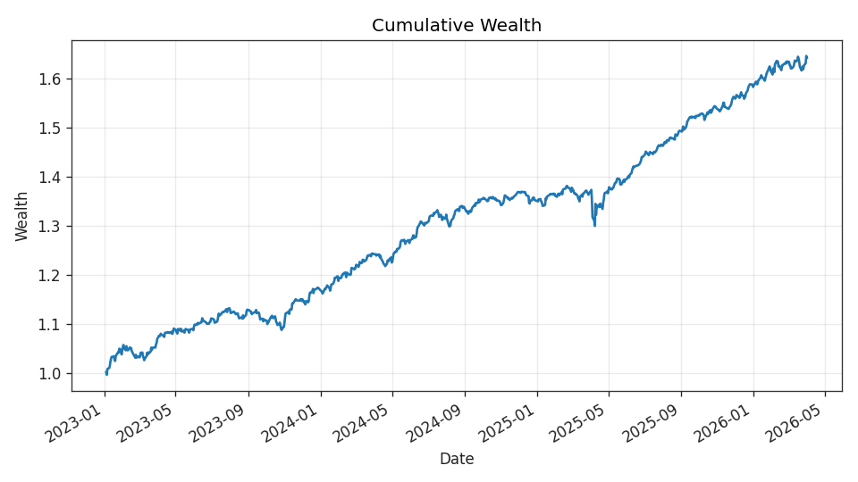
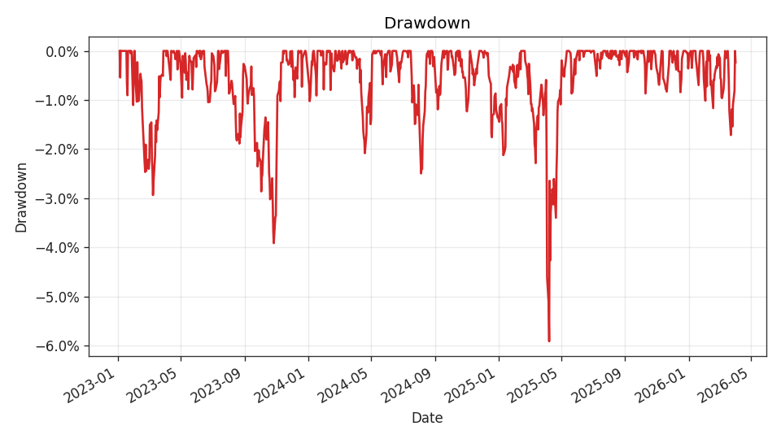
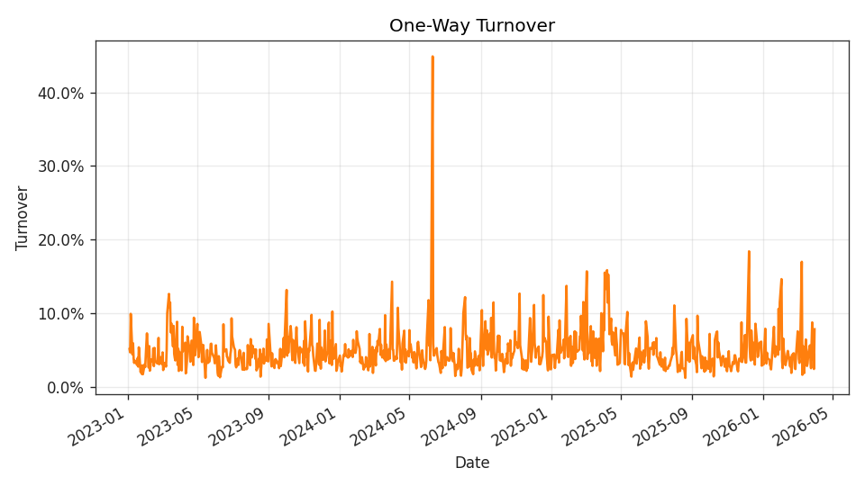
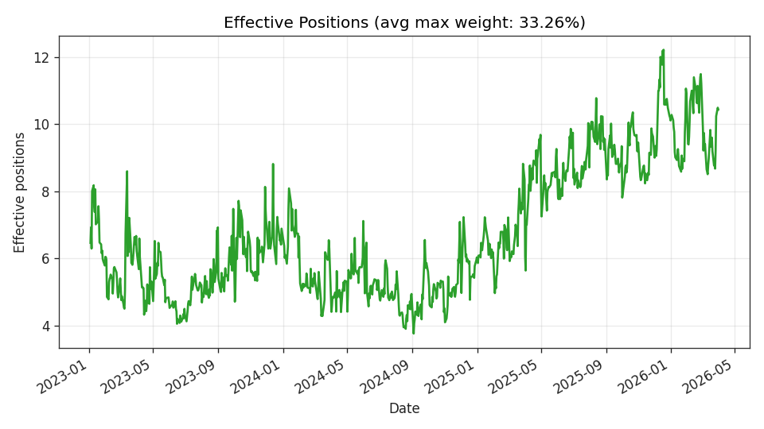
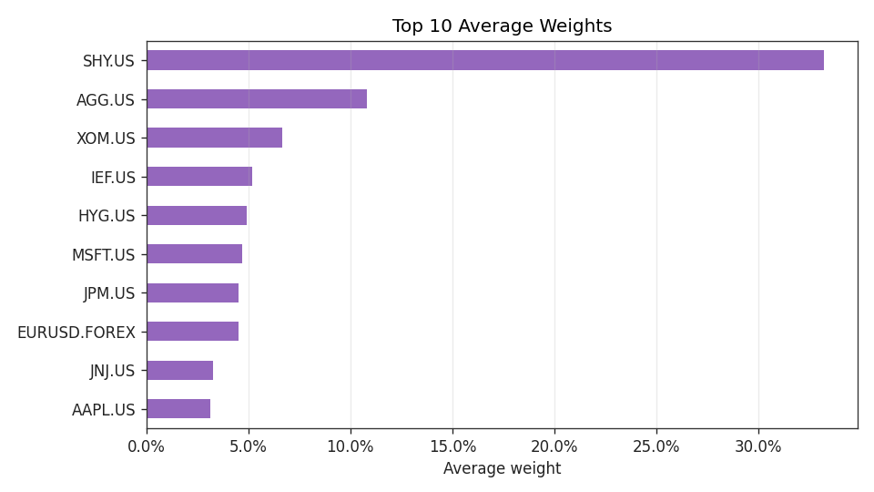

# ML Ensemble MSR Research Handoff

## Executive Summary

This research-only handoff reviews deterministic local artifacts in `results/ml_ensemble_msr_demo` for an ML Ensemble Maximum Sharpe Ratio research run. The artifact contract validated successfully with no missing files or warnings. Reported results are historical backtest evidence only, not investment advice, not target allocations, and not trading recommendations.

Headline bounded evidence shows:
- Strategy label: MSR using ensemble expected-return forecasts.
- Universe size: 29 assets.
- Test-period realized strategy returns: 813 observations from 2023-01-04 to 2026-04-01.
- Total return: 0.641675.
- CAGR: 0.166087.
- Annual volatility: 0.060289.
- Sharpe: 2.579464.
- Maximum drawdown: -0.059160.

Human review required.

## Five-Agent Review Summary

**Data QA Agent**
- Artifact contract status is valid.
- Required source artifacts are present: predictions, weights, strategy returns, metrics, report, and run manifest.
- Bounded evidence shows finite ratios of 1.0 for predictions, weights, and strategy returns.
- Predictions contain one feature output column: `ensemble_pred`.
- Weights row sums are approximately 1.0, with row sum range from 0.9999999999999996 to 1.0000000000000004.
- Local-cache assumptions remain a caveat; cache lineage and vintage require human verification.

**Quant Strategy Agent**
- Strategy uses an equal-weighted ensemble of Lasso, Random Forest, and XGBoost expected-return forecasts.
- Portfolio construction is described as a long-only maximum Sharpe ratio approximation.
- Portfolio weights are lagged by one trading day before return realization.
- Reported metrics are backtest diagnostics only and should not be interpreted as forward-looking expectations.

**Portfolio Risk Agent**
- Concentration is notable: average top-5 weight share is 0.668991, and maximum top-5 weight share is 0.834449.
- Maximum single-asset weight is 0.479322.
- Average effective positions are 6.734010, despite an average of 18.627306 nonzero assets.
- Transaction costs and explicit concentration limits are not included in the baseline evidence.

**Performance Review Agent**
- Reported annualized arithmetic return is 0.155514.
- Reported CAGR is 0.166087.
- Reported annual volatility is 0.060289.
- Reported Sharpe is 2.579464.
- Reported maximum drawdown is -0.059160.
- These metrics require independent human review against notebook benchmarks and published diagnostics.

**Research Handoff Agent**
- This memo is based on deterministic validation, bounded summaries, and rendered evidence only.
- It does not reproduce the deterministic rendered handoff verbatim.
- It preserves the research-only framing and excludes investment advice, target allocations, and trading recommendations.

## Performance Metrics

| Metric | Value |
| --- | ---: |
| Total return | 0.641675 |
| CAGR | 0.166087 |
| Annual return, arithmetic | 0.155514 |
| Annual volatility | 0.060289 |
| Sharpe | 2.579464 |
| Maximum drawdown | -0.059160 |
| Observations | 813 |

Additional strategy return evidence:
- Date range: 2023-01-04 to 2026-04-01.
- Mean return: 0.000617.
- Standard deviation: 0.003798.
- Minimum return: -0.026880.
- Maximum return: 0.034773.
- Finite ratio: 1.0.

## Turnover and Concentration

| Turnover Metric | Value |
| --- | ---: |
| Average turnover | 0.049103 |
| Median turnover | 0.042894 |
| Maximum turnover | 0.448734 |
| Observations | 812 |

| Concentration Metric | Value |
| --- | ---: |
| Average effective positions | 6.734010 |
| Average Herfindahl | 0.160065 |
| Average max weight | 0.332553 |
| Average top-5 weight share | 0.668991 |
| Maximum single-asset weight | 0.479322 |
| Maximum top-5 weight share | 0.834449 |
| Observations | 813 |

Weights artifact evidence:
- Shape: 813 rows by 29 assets.
- Date range: 2023-01-03 to 2026-03-31.
- Minimum weight: 0.0.
- Maximum weight: 0.479322.
- Average nonzero assets: 18.627306.
- Finite ratio: 1.0.

## Figures

## Methodology Caveats

- Research-only historical backtest evidence.
- No investment advice.
- No target allocations.
- No trading recommendations.
- Historical weights are not target allocations.
- Baseline diagnostics do not include transaction costs.
- Concentration diagnostics are descriptive; no explicit concentration constraint is imposed in the baseline.
- The workflow depends on deterministic local cached artifacts; cache lineage, vintage, and universe construction require human review.
- Single-fit ML setup is reported.
- Model components are Lasso, Random Forest, and XGBoost.
- Feature count reported in the deterministic evidence is 17, but bounded summaries only expose the prediction output column `ensemble_pred`; underlying feature definitions should be reviewed from approved source documentation.
- Weights are lagged by one trading day before return realization.
- Notebook benchmark reconciliation remains open.

## Open Questions for Human Review

- Does this run reconcile with Notebook 03 benchmark metrics and published MSR diagnostics?
- Are the local-cache vintage, universe membership, and data lineage approved for research review?
- Are transaction-cost assumptions required before further interpretation?
- Should concentration limits or other optimizer constraints be evaluated in a subsequent research run?
- Are the reported model features and target construction fully documented in approved source materials?
- Are turnover levels robust under realistic implementation assumptions?
- Are any survivorship, liquidity, corporate action, or data availability issues present in the cached universe?

## Human Review Checklist

- [ ] Confirm artifact contract validity.
- [ ] Confirm source cache lineage and data vintage.
- [ ] Confirm universe size and membership assumptions.
- [ ] Review feature definitions and target construction.
- [ ] Reconcile performance metrics with notebook benchmarks.
- [ ] Review turnover and concentration diagnostics.
- [ ] Assess transaction-cost sensitivity requirements.
- [ ] Confirm that historical weights are not interpreted as target allocations.
- [ ] Confirm research-only usage and no trading interpretation.
- [ ] Approve or reject the run for further research analysis.

## Appendix / Source Artifacts

The deterministic source artifacts are:
- run_manifest.json
- metrics.json
- report.md
- predictions.parquet
- weights.parquet
- strategy_returns.parquet
- figures/*.png

Artifact directory: `results/ml_ensemble_msr_demo`

Artifact contract status:
- Valid: true.
- Missing files: none.
- Warnings: none.